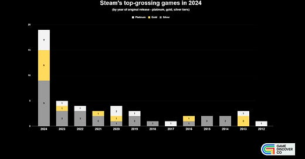
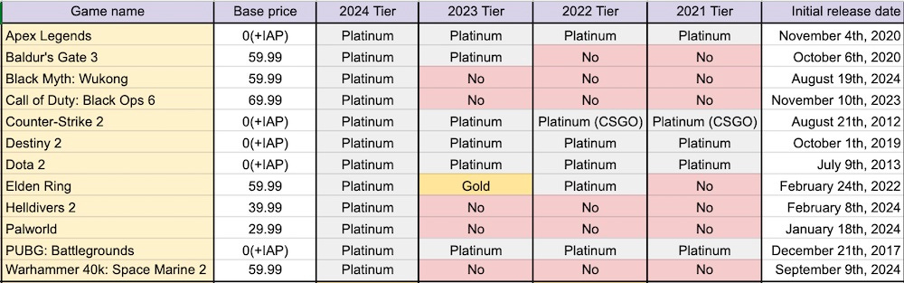
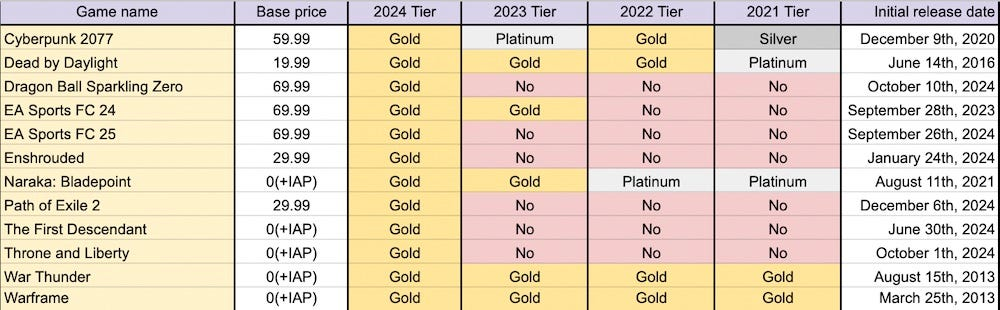
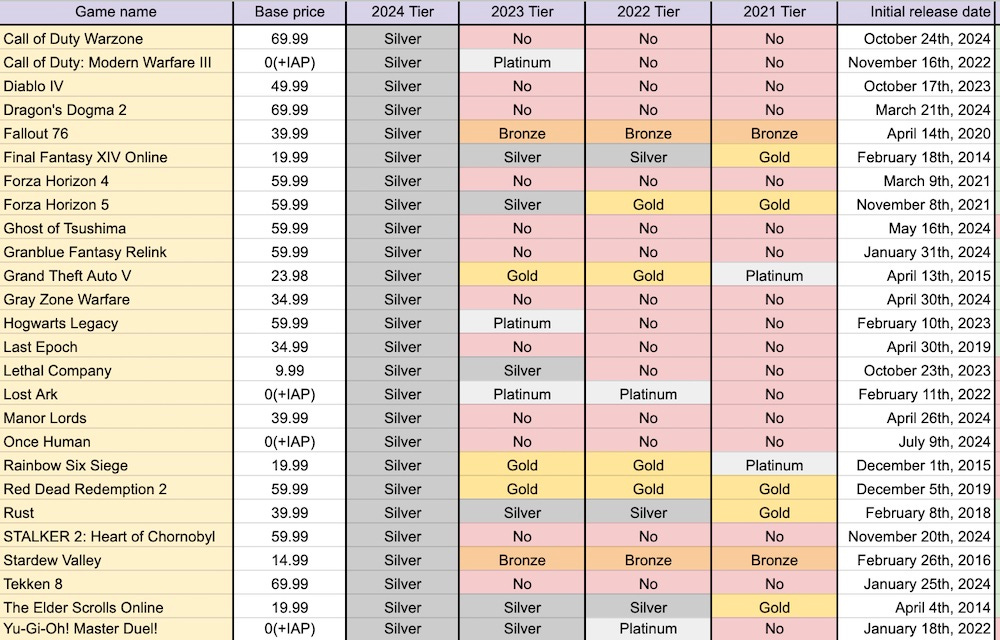
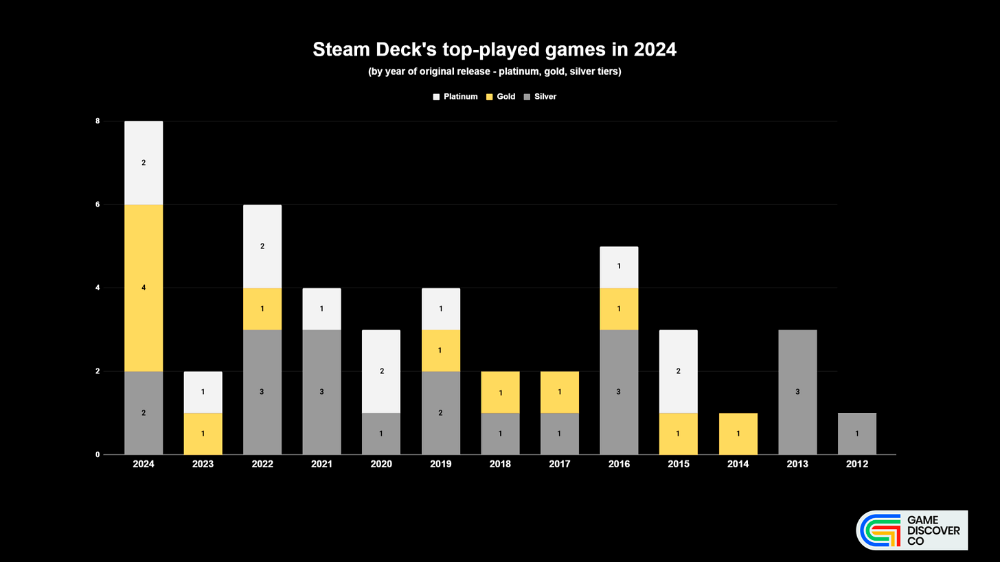
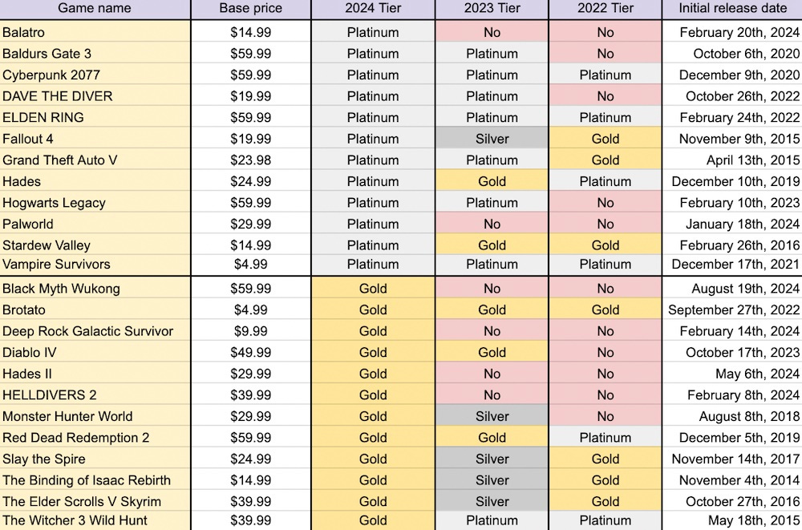

@layer legacy, tailwind, pencraft;

Steam's top-grossing games of 2024 revealed, analyzed

@font-face{font-family:'Spectral';font-style:italic;font-weight:400;font-display:fallback;src:url(https://fonts.gstatic.com/s/spectral/v13/rnCt-xNNww\_2s0amA9M8on7mTNmnUHowCw.woff2) format('woff2');unicode-range:U+0301,U+0400-045F,U+0490-0491,U+04B0-04B1,U+2116}@font-face{font-family:'Spectral';font-style:italic;font-weight:400;font-display:fallback;src:url(https://fonts.gstatic.com/s/spectral/v13/rnCt-xNNww\_2s0amA9M8onXmTNmnUHowCw.woff2) format('woff2');unicode-range:U+0102-0103,U+0110-0111,U+0128-0129,U+0168-0169,U+01A0-01A1,U+01AF-01B0,U+0300-0301,U+0303-0304,U+0308-0309,U+0323,U+0329,U+1EA0-1EF9,U+20AB}@font-face{font-family:'Spectral';font-style:italic;font-weight:400;font-display:fallback;src:url(https://fonts.gstatic.com/s/spectral/v13/rnCt-xNNww\_2s0amA9M8onTmTNmnUHowCw.woff2) format('woff2');unicode-range:U+0100-02AF,U+0304,U+0308,U+0329,U+1E00-1E9F,U+1EF2-1EFF,U+2020,U+20A0-20AB,U+20AD-20CF,U+2113,U+2C60-2C7F,U+A720-A7FF}@font-face{font-family:'Spectral';font-style:italic;font-weight:400;font-display:fallback;src:url(https://fonts.gstatic.com/s/spectral/v13/rnCt-xNNww\_2s0amA9M8onrmTNmnUHo.woff2) format('woff2');unicode-range:U+0000-00FF,U+0131,U+0152-0153,U+02BB-02BC,U+02C6,U+02DA,U+02DC,U+0304,U+0308,U+0329,U+2000-206F,U+2074,U+20AC,U+2122,U+2191,U+2193,U+2212,U+2215,U+FEFF,U+FFFD}@font-face{font-family:'Spectral';font-style:normal;font-weight:400;font-display:fallback;src:url(https://fonts.gstatic.com/s/spectral/v13/rnCr-xNNww\_2s0amA9M9knjsS\_ulYHs.woff2) format('woff2');unicode-range:U+0301,U+0400-045F,U+0490-0491,U+04B0-04B1,U+2116}@font-face{font-family:'Spectral';font-style:normal;font-weight:400;font-display:fallback;src:url(https://fonts.gstatic.com/s/spectral/v13/rnCr-xNNww\_2s0amA9M2knjsS\_ulYHs.woff2) format('woff2');unicode-range:U+0102-0103,U+0110-0111,U+0128-0129,U+0168-0169,U+01A0-01A1,U+01AF-01B0,U+0300-0301,U+0303-0304,U+0308-0309,U+0323,U+0329,U+1EA0-1EF9,U+20AB}@font-face{font-family:'Spectral';font-style:normal;font-weight:400;font-display:fallback;src:url(https://fonts.gstatic.com/s/spectral/v13/rnCr-xNNww\_2s0amA9M3knjsS\_ulYHs.woff2) format('woff2');unicode-range:U+0100-02AF,U+0304,U+0308,U+0329,U+1E00-1E9F,U+1EF2-1EFF,U+2020,U+20A0-20AB,U+20AD-20CF,U+2113,U+2C60-2C7F,U+A720-A7FF}@font-face{font-family:'Spectral';font-style:normal;font-weight:400;font-display:fallback;src:url(https://fonts.gstatic.com/s/spectral/v13/rnCr-xNNww\_2s0amA9M5knjsS\_ul.woff2) format('woff2');unicode-range:U+0000-00FF,U+0131,U+0152-0153,U+02BB-02BC,U+02C6,U+02DA,U+02DC,U+0304,U+0308,U+0329,U+2000-206F,U+2074,U+20AC,U+2122,U+2191,U+2193,U+2212,U+2215,U+FEFF,U+FFFD}@font-face{font-family:'Spectral';font-style:normal;font-weight:600;font-display:fallback;src:url(https://fonts.gstatic.com/s/spectral/v13/rnCs-xNNww\_2s0amA9vmtm3FafaPWnIIMrY.woff2) format('woff2');unicode-range:U+0301,U+0400-045F,U+0490-0491,U+04B0-04B1,U+2116}@font-face{font-family:'Spectral';font-style:normal;font-weight:600;font-display:fallback;src:url(https://fonts.gstatic.com/s/spectral/v13/rnCs-xNNww\_2s0amA9vmtm3OafaPWnIIMrY.woff2) format('woff2');unicode-range:U+0102-0103,U+0110-0111,U+0128-0129,U+0168-0169,U+01A0-01A1,U+01AF-01B0,U+0300-0301,U+0303-0304,U+0308-0309,U+0323,U+0329,U+1EA0-1EF9,U+20AB}@font-face{font-family:'Spectral';font-style:normal;font-weight:600;font-display:fallback;src:url(https://fonts.gstatic.com/s/spectral/v13/rnCs-xNNww\_2s0amA9vmtm3PafaPWnIIMrY.woff2) format('woff2');unicode-range:U+0100-02AF,U+0304,U+0308,U+0329,U+1E00-1E9F,U+1EF2-1EFF,U+2020,U+20A0-20AB,U+20AD-20CF,U+2113,U+2C60-2C7F,U+A720-A7FF}@font-face{font-family:'Spectral';font-style:normal;font-weight:600;font-display:fallback;src:url(https://fonts.gstatic.com/s/spectral/v13/rnCs-xNNww\_2s0amA9vmtm3BafaPWnII.woff2) format('woff2');unicode-range:U+0000-00FF,U+0131,U+0152-0153,U+02BB-02BC,U+02C6,U+02DA,U+02DC,U+0304,U+0308,U+0329,U+2000-206F,U+2074,U+20AC,U+2122,U+2191,U+2193,U+2212,U+2215,U+FEFF,U+FFFD}
:root{--color\_theme\_bg\_pop:#121bfa;--background\_pop:#121bfa;--cover\_bg\_color:#FFFFFF;--background\_pop\_darken:#050eed;--print\_on\_pop:#ffffff;--color\_theme\_bg\_pop\_darken:#050eed;--color\_theme\_print\_on\_pop:#ffffff;--border\_subtle:#e0e0f6;--background\_subtle:rgba(219, 221, 254, 0.4);--print\_pop:#121bfa;--color\_theme\_accent:#121bfa;--cover\_print\_primary:#363737;--cover\_print\_secondary:#757575;--cover\_print\_tertiary:#b6b6b6;--cover\_border\_color:#121bfa;--home\_hero:newspaper;--home\_posts:list;--background\_contrast\_1:#f0f0f0;--background\_contrast\_2:#dddddd;--background\_contrast\_3:#b7b7b7;--background\_contrast\_4:#929292;--background\_contrast\_5:#515151;--color\_theme\_detail:#e6e6e6;--background\_contrast\_pop:rgba(18, 27, 250, 0.4);--color\_theme\_bg\_contrast\_pop:rgba(18, 27, 250, 0.4);--input\_background:#ffffff;--cover\_input\_background:#ffffff;--tooltip\_background:#191919;--background\_pop\_rgb:18, 27, 250;--background\_pop\_rgb\_pc:18 27 250;--color\_theme\_bg\_pop\_rgb:18, 27, 250;--color\_theme\_bg\_pop\_rgb\_pc:18 27 250;--color\_theme\_accent\_rgb:18, 27, 250;--color\_theme\_accent\_rgb\_pc:18 27 250;}

The GameDiscoverCo newsletterGive giftGift a subscription{"@context":"https://schema.org","@type":"NewsArticle","url":"https://newsletter.gamediscover.co/p/steams-top-grossing-games-of-2024","mainEntityOfPage":"https://newsletter.gamediscover.co/p/steams-top-grossing-games-of-2024","headline":"Steam's top-grossing games of 2024 revealed, analyzed","description":"Also: lots of news, a special announcement & a new hire.","image":[{"@type":"ImageObject","url":"https://substackcdn.com/image/fetch/f\_auto,q\_auto:good,fl\_progressive:steep/https%3A%2F%2Fsubstack-post-media.s3.amazonaws.com%2Fpublic%2Fimages%2Fe09e19b1-70dc-4d37-8c69-0521c947b595\_1920x1080.png"}],"datePublished":"2025-01-03T17:57:32+00:00","dateModified":"2025-01-03T17:57:32+00:00","isAccessibleForFree":false,"author":[{"@type":"Person","name":"Simon Carless","url":"https://substack.com/@simoncarless","description":"I'm the founder of GameDiscoverCo, and a former game dev, Independent Games Festival chairperson & Game Developers Conference co-runner.","identifier":"user:43851","image":{"@type":"ImageObject","contentUrl":"https://substackcdn.com/image/fetch/f\_auto,q\_auto:good,fl\_progressive:steep/https%3A%2F%2Fbucketeer-e05bbc84-baa3-437e-9518-adb32be77984.s3.amazonaws.com%2Fpublic%2Fimages%2F3dd8d392-42ea-4bd5-911f-5930ded5da8d\_960x960.jpeg","thumbnailUrl":"https://substackcdn.com/image/fetch/w\_128,h\_128,c\_limit,f\_auto,q\_auto:good,fl\_progressive:steep/https%3A%2F%2Fbucketeer-e05bbc84-baa3-437e-9518-adb32be77984.s3.amazonaws.com%2Fpublic%2Fimages%2F3dd8d392-42ea-4bd5-911f-5930ded5da8d\_960x960.jpeg"}}],"publisher":{"@type":"Organization","name":"The GameDiscoverCo newsletter","url":"https://newsletter.gamediscover.co","description":"Analysis, data and insight about how people find & buy video games in the 2020s.","interactionStatistic":{"@type":"InteractionCounter","name":"Subscribers","interactionType":"https://schema.org/SubscribeAction","userInteractionCount":10000},"identifier":"pub:14089","logo":{"@type":"ImageObject","url":"https://substackcdn.com/image/fetch/f\_auto,q\_auto:good,fl\_progressive:steep/https%3A%2F%2Fsubstack-post-media.s3.amazonaws.com%2Fpublic%2Fimages%2Fc4ecd3b8-0264-4896-8b6e-4cfeffc01276\_840x840.png","contentUrl":"https://substackcdn.com/image/fetch/f\_auto,q\_auto:good,fl\_progressive:steep/https%3A%2F%2Fsubstack-post-media.s3.amazonaws.com%2Fpublic%2Fimages%2Fc4ecd3b8-0264-4896-8b6e-4cfeffc01276\_840x840.png","thumbnailUrl":"https://substackcdn.com/image/fetch/w\_128,h\_128,c\_limit,f\_auto,q\_auto:good,fl\_progressive:steep/https%3A%2F%2Fsubstack-post-media.s3.amazonaws.com%2Fpublic%2Fimages%2Fc4ecd3b8-0264-4896-8b6e-4cfeffc01276\_840x840.png"},"image":{"@type":"ImageObject","url":"https://substackcdn.com/image/fetch/f\_auto,q\_auto:good,fl\_progressive:steep/https%3A%2F%2Fsubstack-post-media.s3.amazonaws.com%2Fpublic%2Fimages%2Fc4ecd3b8-0264-4896-8b6e-4cfeffc01276\_840x840.png","contentUrl":"https://substackcdn.com/image/fetch/f\_auto,q\_auto:good,fl\_progressive:steep/https%3A%2F%2Fsubstack-post-media.s3.amazonaws.com%2Fpublic%2Fimages%2Fc4ecd3b8-0264-4896-8b6e-4cfeffc01276\_840x840.png","thumbnailUrl":"https://substackcdn.com/image/fetch/w\_128,h\_128,c\_limit,f\_auto,q\_auto:good,fl\_progressive:steep/https%3A%2F%2Fsubstack-post-media.s3.amazonaws.com%2Fpublic%2Fimages%2Fc4ecd3b8-0264-4896-8b6e-4cfeffc01276\_840x840.png"}}}Share this postThe GameDiscoverCo newsletterSteam's top-grossing games of 2024 revealed, analyzedCopy linkFacebookEmailNotesMoreSteam's top-grossing games of 2024 revealed, analyzedAlso: lots of news, a special announcement & a new hire.Simon CarlessJan 03, 2025∙ Paid15Share this post with a friendSince you liked this post, why not share it to help spread the word?ShareShare this postThe GameDiscoverCo newsletterSteam's top-grossing games of 2024 revealed, analyzedCopy linkFacebookEmailNotesMore1Share[The GameDiscoverCo game discovery newsletter is written by ‘how people find your game’ expert & company founder Simon Carless, and is a regular look at how people discover and buy video games in the 2020s.]We’re back, folks, and it’s 2025, the year that the movie Pacific Rim is set in. So, our 2025 industry prediction is that “world leaders decide to cease funding for the Jaeger program” due to Kaiju attacks. (Wait, weren’t we meant to say something about Switch 2 here?) Anyhow, we have an action-packed newsletter for you, so let’s hit it…Reveal: GameDiscoverCo x 50 clients, new biz starMost of you know GameDiscoverCo from this very newsletter. But we’ve been quietly fleshing out our GDCo Pro back-end - a massively enhanced set of Steam ‘deep dive’ and console data compared to our inexpensive GDCo Plus offering - for >a year now.So we’re delighted to announce the following:We’ve hit a milestone - 50 game companies licensing our ‘full’ Pro data: they span everyone from the biggest VCs, through the coolest indie publishers, and many signature firms you might have heard of. (We were stealthy about that, huh?)If you didn’t yet, we’ve got someone you can talk to: we’re delighted to announce that Matt Styles - former head of game events at ReedPop (PAX, EGX) and co-creator of the much loved WASD UK indie event - is joining GDCo as our head of biz dev to help us improve & expand this product & ‘take things to the next level’. Matt’s a true friend to the game biz, and will be at GDC (San Francisco), Reboot Develop (Dubrovnik), Develop (Brighton) & Gamescom (Cologne) in 2025 if you’d like to chat to him in-person. And he’s available on email and for video demos pretty much any time.We’re excited to be spreading the word on GDCo’s Pro Steam ‘deep dive’ and full console data - because it’s a) a great ‘we track everything’ alt to the ‘800 pound gorillas’ of the space, and b) it’s way more fully featured than other ‘ground-up’ solutions. (And it all comes with full access to the paid newsletter & Discord, of course!) Onward…Game discovery news: oh 2024, where did you go?Before we get onto the main feature, we have a great deal of news to catch up on since our last newsletter in mid-December. So let’s disgorge a chunk of it now:Lots of end-of-year round-ups hit: we really dug SkillUp’s rewind of 2024 (above), Adam Millard’s ‘games you should have played in 2024’ video, and PC Gamer on why “PC gaming [in 2024] is still extremely weird” - in a good way - as well as The Verge on why gameplay diversity ruled last year. (And, uhh, Todd & Aaron’s erudition.)Those Switch 2 leaks keep piling up: before the holidays, more reports that Nintendo’s Switch successor will have magnetic controllers with drift-resistant sticks, and possibly extra power when docked; images of the Switch 2’s motherboard also seem to have surfaced. (But mainly: it’s a souped-up Switch!)Dungeon Investing’s analysis of Square Enix ends with an interesting quote: “In this market, 2 types of companies can go well. Hyper cost-conscious (PlayWay, Falcom), or really focused companies with not many releases. The era of flooding the market with AA games has passed.” (He thinks SQEX is now “focusing & avoiding cannibalization.”)We’ll look at unreleased Steam ‘trending games’ again on Monday, but the holiday edition saw a surprise announce & pre-order from Space Engineers 2 (#1) leading the charts, closely followed by Elden Ring Nightreign (#2), the PC version of Final Fantasy VII Rebirth (#3), and the still-trending, Terraria-adjacent Kyora (#4).Fascinating to see the New York Times’ mainstream piece on how graphics aren’t the key trend driving video game sales, as it notes: “Optimizing cinematic games for a narrow group of consumers who have spent hundreds of dollars on a console or computer may no longer make financial sense.” (And ties in to industry woes.)Talking of ‘extra horsepower’, PlayStation 5 Pro got the ‘explainer’ it probably should’ve at announce, with lead architect Mark Cerny doing an in-depth ‘technical seminar’ and talking to Digital Foundry. (The tech is cutting-edge and incredibly impressive - but will most devs unlock its potential? We hope so!)The player-voted winners of The Steam Awards? Black Myth: Wukong made up for its possible over-reaction to not winning The Game Awards by grabbing Game Of The Year. Elsewhere, Labor Of Love went to Elden Ring + DLC, Better With Friends to Helldivers 2, and Liar’s Bar got Innovative Gameplay.Circana’s Nov. 2024 U.S. hardware and select software results dropped when we were out for break, and Call Of Duty 6 did very well (duh!), already becoming the #2-seller for the year. Also: PS5 $ sales were up 15% YoY, aided by PS5 Pro, and “Nintendo Switch surpassed PlayStation 2 in US lifetime hardware unit sales.”Looking at GDCo’s Switch eShop charts ($, recent, paid third-party, U.S. by download #), Just Dance 2025’s 60% discount charted it in the overall Top 30, MySims Cozy Bundle continues to perform at #40, while the older Sonic X Shadow Generations Deluxe rides Sonic movie mania to #90. (It’s a bit slow for brand new releases, tho.)Here’s an interesting stat on Sony’s PS Portal ‘WiFi x PS5 handheld’, per a Game File interview: “PS Portal usage peaks at 9pm [and] PS5 usage peaks at 8pm… Sony thinks that may mean Portal users relinquish their TVs to family by 9pm, then keep playing via their Portal.”As for 2024’s Twitch year in review, via StreamElements and Rainmaker.gg, there were 18.9 billion hours watched in 2024, vs. 18.5b in 2023. Twitch’s top 10 most-streamed games have “remained almost unchanged for 5 years” - headed in 2024 by GTA, LoL, Valorant, Counter-Strike, Fortnite, DOTA 2 and Minecraft.You know those Steam take-overs, when Valve decides your game deserves a giant editorial header on the Steam front page? According to GDCo’s Alejandro, there were 115 homepage takeovers in 2024 - all viewable via SteamDB here - compared to 94 in 2023, 92 in 2022, and 91 in 2021. The more you know…Microlinks: PlayStation Plus’ three Essential games for Jan. 2025 are Suicide Squad, Need for Speed Hot Pursuit & The Stanley Parable; over its entire (very long!) history, Second Life has paid out $1.1 billion to creators; Meta Quest had a bad OS update over the holidays which bricked some (not often-updated) devices.Steam's top $ games of 2024 revealed, analyzed..We looked at the top-grossing new PC games of 2024 just before the holidays. But since then, Valve put up their ‘Best of 2024’ sale page (above), which very handily groups Steam’s top games of 2024 by gross revenue into tiers, regardless of age. So let’s look at multi-year trends, age of hits, and what those tiers might be, $-wise…Firstly, we’ve taken the overall top-grossing games in the Platinum, Gold and Silver charts, created a ‘chart trending’ document (Google Drive doc), and mapped them to the year that they were first available on Steam:Some brief notes on these interesting trends:19 games out of the ~50 top-grossers came out in 2024: that’s actually slightly up on the 17 games released that year in our ‘end of 2023’ analysis. So about 35% of the ‘revenue hits’ are new, in recent years.The rest of the top-grossing games go back a decade-plus: 16 of the remaining games came out in the 2020s, and the other 15 in the 2010s. Here’s the full rundown: “2023 - 5; 2022 - 4; 2021 - 3; 2020 - 4; 2019 - 3; 2018 - 1; 2017 - 1; 2016 - 2; 2015 - 2; 2014 - 2; 2013 - 3; 2012 - 1.” Most ‘new’ games will fade down - or off - the charts in 2025: specifically, only 5 of the 17 ‘hits’ in 2023 stayed higher up the chart in 2024 - one at Platinum (Baldur’s Gate 3), one at Gold (EA Sports FC 24), and three at Silver (Call Of Duty: Modern Warfare III, Hogwarts Legacy, and Lethal Company.) Given the make-up of these ‘made it from 2023 to 2024’ titles - two yearly franchise updates, with most other games on the fade-out - this clearly shows the lack of evergreen GaaS titles being created in recent years. (Not news, but good to see facts.)Finally, let’s have a look at multi-year trending - back to 2021 here, but the full document has data back to 2019 - of Steam top-grossing tiers. Let’s start with Platinum, listed alphabetically, since the order is randomized by Steam:There’s a clear bifurcation here of the brand-new, premium-first hits (Black Myth, Palworld, Space Marine 2) alongside the evergreen GaaS titles (DOTA 2, Counter-Strike 2, Apex Legends, PUBG.) Also interesting to see Elden Ring going back up to Platinum in 2024 thanks to its Shadow Of The Erdtree DLC. Next up, Gold:Lots of obvious games in here - for example Cyberpunk, two EA Sports FC games, and some oldies but goodies like War Thunder and Warframe - which keep on monetizing efficiently, a decade plus later…There’s also a few semi-surprises - Naraka: Bladepoint still performing well in Asia (it has 50% China and only 7% U.S. players.) And we’ll see if ‘now’ GaaS hits The First Descendant and Throne and Liberty can hang on in 2025. (Maybe they can!)Finally, let’s see the Silver tier games - though again, the full doc has the 50 Bronze games too if you want to check those:A few highlights here? Fallout 76 making it up to Silver tier for the first time in recent memory, aided by the hit Fallout TV show. And Forza Horizon 4’s delisting in December meant it made the charts too, as people grabbed it before it disappeared…It’s also notable to see a couple of evergreens like Grand Theft Auto V and Rainbow Six Siege flagging a tiny bit. (Although, since this is a tier-based system, it’s also possible they got similar revenue to last year, but other games did better.)Talking of tiers, we do have some estimates of gross 2024 Steam revenue for these tiers, based on GDCo data: we think 2024’s Bronze tier is $10-$30m revenue, Silver is $30-$60m, Gold is $60-$100m, and Platinum is over $100m. (In some cases, a long way over, since a handful of the top titles made hundreds of millions!) Bonus: most-played Steam Deck games in 2024?The sharp-eyed among you may have noticed that ‘Most-played Steam Deck games’ is also a category in Valve’s ‘Best Of 2024’ page, as it has been since 2022. So we decided to do a quick breakdown of that, too! (It’s the second tab of the document.)Above are Platinum, Gold and Silver tiers, by original release year. There’s a lot of overlap with top-grossing releases, of course, with new debuts like Palworld and slightly older releases like Baldur’s Gate 3 and Cyberpunk all making Platinum.There’s also a set of lower cost, particularly handheld-friendly games - such as Balatro, Dave The Diver, and Vampire Survivors, which seem to permanently hang near the top of the charts. So finally, look, here’s 2022 to 2024 in most-played Steam Deck charts, Platinum and Gold tiers only:That’s pretty interesting data, especially with games like Slay The Spire, The Binding Of Isaac: Rebirth and Skyrim surging back into Gold tier in 2024, after being Silver in 2023. (They’re true evergreens!)And that’s all we have for this week. Welcome back, and we’ll be back to our regular Tuesday and Friday GDCo newsletter schedule, starting next week. Toodles…[We’re GameDiscoverCo, an agency based around one simple issue: how do players find, buy and enjoy your PC/console game? Reminder to paid subs: you also get access to our basic Plus data back-end and our Plus member Discord as part of your subscription - feel free to use ‘em!]15Share this post with a friendSince you liked this post, why not share it to help spread the word?ShareShare this postThe GameDiscoverCo newsletterSteam's top-grossing games of 2024 revealed, analyzedCopy linkFacebookEmailNotesMore1ShareDiscussion about this postCommentsRestacksTopLatestDiscussionsNo posts© 2025 Game Discovery Now LLCPrivacy ∙ Terms ∙ Collection notice Start WritingGet the appSubstack is the home for great cultureShareCopy linkFacebookEmailNotesMore

window.Sentry && window.Sentry.onLoad(function() {
window.Sentry.init({
environment: window.\_preloads.sentry\_environment,
dsn: window.\_preloads.sentry\_dsn,
})
})
window.\_preloads = JSON.parse("{\"isEU\":false,\"language\":\"en\",\"country\":\"JP\",\"base\_url\":\"https://newsletter.gamediscover.co\",\"stripe\_publishable\_key\":\"pk\_live\_vNnuGHOFnt4mM7V9PuCAAPJz\",\"captcha\_site\_key\":\"6LdYbsYZAAAAAIFIRh8X\_16GoFRLIReh-e-q6qSa\",\"pub\":{\"apple\_pay\_disabled\":false,\"apex\_domain\":null,\"author\_id\":43851,\"byline\_images\_enabled\":false,\"bylines\_enabled\":true,\"chartable\_token\":null,\"community\_enabled\":true,\"copyright\":\"Game Discovery Now LLC\",\"cover\_photo\_url\":null,\"created\_at\":\"2019-07-23T16:49:01.685Z\",\"custom\_domain\_optional\":false,\"custom\_domain\":\"newsletter.gamediscover.co\",\"custom\_publication\_theme\_id\":null,\"default\_comment\_sort\":\"best\_first\",\"default\_coupon\":null,\"default\_group\_coupon\":\"1c25a1f0\",\"default\_show\_guest\_bios\":true,\"email\_banner\_url\":\"https://substack-post-media.s3.amazonaws.com/public/images/d3037fef-9d10-41bb-b096-65f7afea7e57\_1100x220.png\",\"email\_from\_name\":\"Simon from GameDiscoverCo\",\"email\_from\":null,\"embed\_tracking\_disabled\":false,\"explicit\":false,\"expose\_paywall\_content\_to\_search\_engines\":true,\"fb\_pixel\_id\":null,\"fb\_site\_verification\_token\":null,\"flagged\_as\_spam\":false,\"founding\_subscription\_benefits\":[\"For any company; 'basic' data & newsletter access for everybody on your email domain\"],\"free\_subscription\_benefits\":[\"Game discovery newsletters, once a week.\"],\"ga\_pixel\_id\":\"\",\"google\_site\_verification\_token\":null,\"google\_tag\_manager\_token\":\"G-R5GRP7EM49\",\"hero\_image\":null,\"hero\_text\":\"Analysis, data and insight about how people find & buy video games in the 2020s.\",\"hide\_intro\_subtitle\":null,\"hide\_intro\_title\":null,\"hide\_podcast\_feed\_link\":false,\"homepage\_type\":\"newspaper\",\"id\":14089,\"image\_thumbnails\_always\_enabled\":false,\"invite\_only\":false,\"language\":\"en\",\"logo\_url\_wide\":null,\"logo\_url\":\"https://substackcdn.com/image/fetch/f\_auto,q\_auto:good,fl\_progressive:steep/https%3A%2F%2Fsubstack-post-media.s3.amazonaws.com%2Fpublic%2Fimages%2Fc4ecd3b8-0264-4896-8b6e-4cfeffc01276\_840x840.png\",\"minimum\_group\_size\":2,\"moderation\_enabled\":true,\"name\":\"The GameDiscoverCo newsletter\",\"paid\_subscription\_benefits\":[\"Our full suite of newsletters with new game success analysis, trends, links & more.\",\"Access to our basic Plus data suite with prediction tools, 'Hype' rankings & revenue/player estimates for PC/console games\",\"Eight info-packed \u2018evergreen advice & case studies\u2019 eBooks, a GameDiscoverCo Discord to share knowledge, and more...\"],\"parsely\_pixel\_id\":null,\"payments\_state\":\"enabled\",\"paywall\_free\_trial\_enabled\":false,\"podcast\_art\_url\":\"https://bucketeer-e05bbc84-baa3-437e-9518-adb32be77984.s3.amazonaws.com/public/images/b894fca1-2c9c-4e21-831c-cd69c4f31016\_2000x2000.png\",\"paid\_podcast\_episode\_art\_url\":null,\"podcast\_byline\":\"Simon Carless\",\"podcast\_description\":\"Conversations with smart people in the video game industry on how games get discovered and played.\",\"podcast\_enabled\":true,\"podcast\_feed\_url\":null,\"podcast\_title\":\"Tales From GameDiscoveryLand\",\"post\_preview\_limit\":null,\"require\_clickthrough\":false,\"show\_pub\_podcast\_tab\":false,\"show\_recs\_on\_homepage\":true,\"subdomain\":\"gamediscoverability\",\"subscriber\_invites\":0,\"support\_email\":null,\"theme\_var\_background\_pop\":\"#121bfa\",\"theme\_var\_color\_links\":false,\"theme\_var\_cover\_bg\_color\":null,\"trial\_end\_override\":null,\"twitter\_pixel\_id\":null,\"type\":\"newsletter\",\"post\_reaction\_faces\_enabled\":true,\"is\_personal\_mode\":false,\"plans\":[{\"id\":\"price\_1PXlJrIIbv2NfsTVWTiQiKc1\",\"object\":\"plan\",\"active\":true,\"aggregate\_usage\":null,\"amount\":1900,\"amount\_decimal\":\"1900\",\"billing\_scheme\":\"per\_unit\",\"created\":1719844503,\"currency\":\"usd\",\"interval\":\"month\",\"interval\_count\":1,\"livemode\":true,\"metadata\":{\"substack\":\"yes\"},\"meter\":null,\"nickname\":\"$19 a month\",\"product\":\"prod\_OZ2dXkmi62aLpx\",\"tiers\":null,\"tiers\_mode\":null,\"transform\_usage\":null,\"trial\_period\_days\":null,\"usage\_type\":\"licensed\",\"currency\_options\":{\"aud\":{\"custom\_unit\_amount\":null,\"tax\_behavior\":\"unspecified\",\"unit\_amount\":3100,\"unit\_amount\_decimal\":\"3100\"},\"brl\":{\"custom\_unit\_amount\":null,\"tax\_behavior\":\"unspecified\",\"unit\_amount\":11500,\"unit\_amount\_decimal\":\"11500\"},\"cad\":{\"custom\_unit\_amount\":null,\"tax\_behavior\":\"unspecified\",\"unit\_amount\":2800,\"unit\_amount\_decimal\":\"2800\"},\"chf\":{\"custom\_unit\_amount\":null,\"tax\_behavior\":\"unspecified\",\"unit\_amount\":1800,\"unit\_amount\_decimal\":\"1800\"},\"dkk\":{\"custom\_unit\_amount\":null,\"tax\_behavior\":\"unspecified\",\"unit\_amount\":14000,\"unit\_amount\_decimal\":\"14000\"},\"eur\":{\"custom\_unit\_amount\":null,\"tax\_behavior\":\"unspecified\",\"unit\_amount\":1900,\"unit\_amount\_decimal\":\"1900\"},\"gbp\":{\"custom\_unit\_amount\":null,\"tax\_behavior\":\"unspecified\",\"unit\_amount\":1600,\"unit\_amount\_decimal\":\"1600\"},\"mxn\":{\"custom\_unit\_amount\":null,\"tax\_behavior\":\"unspecified\",\"unit\_amount\":39000,\"unit\_amount\_decimal\":\"39000\"},\"nok\":{\"custom\_unit\_amount\":null,\"tax\_behavior\":\"unspecified\",\"unit\_amount\":21500,\"unit\_amount\_decimal\":\"21500\"},\"nzd\":{\"custom\_unit\_amount\":null,\"tax\_behavior\":\"unspecified\",\"unit\_amount\":3400,\"unit\_amount\_decimal\":\"3400\"},\"pln\":{\"custom\_unit\_amount\":null,\"tax\_behavior\":\"unspecified\",\"unit\_amount\":8000,\"unit\_amount\_decimal\":\"8000\"},\"sek\":{\"custom\_unit\_amount\":null,\"tax\_behavior\":\"unspecified\",\"unit\_amount\":21000,\"unit\_amount\_decimal\":\"21000\"},\"usd\":{\"custom\_unit\_amount\":null,\"tax\_behavior\":\"unspecified\",\"unit\_amount\":1900,\"unit\_amount\_decimal\":\"1900\"}}},{\"id\":\"price\_1PXlJrIIbv2NfsTV9HhDEcRR\",\"object\":\"plan\",\"active\":true,\"aggregate\_usage\":null,\"amount\":19000,\"amount\_decimal\":\"19000\",\"billing\_scheme\":\"per\_unit\",\"created\":1719844503,\"currency\":\"usd\",\"interval\":\"year\",\"interval\_count\":1,\"livemode\":true,\"metadata\":{\"substack\":\"yes\"},\"meter\":null,\"nickname\":\"$190 a year\",\"product\":\"prod\_OZ2d2cYbiq523e\",\"tiers\":null,\"tiers\_mode\":null,\"transform\_usage\":null,\"trial\_period\_days\":null,\"usage\_type\":\"licensed\",\"currency\_options\":{\"aud\":{\"custom\_unit\_amount\":null,\"tax\_behavior\":\"unspecified\",\"unit\_amount\":30500,\"unit\_amount\_decimal\":\"30500\"},\"brl\":{\"custom\_unit\_amount\":null,\"tax\_behavior\":\"unspecified\",\"unit\_amount\":113000,\"unit\_amount\_decimal\":\"113000\"},\"cad\":{\"custom\_unit\_amount\":null,\"tax\_behavior\":\"unspecified\",\"unit\_amount\":27500,\"unit\_amount\_decimal\":\"27500\"},\"chf\":{\"custom\_unit\_amount\":null,\"tax\_behavior\":\"unspecified\",\"unit\_amount\":17500,\"unit\_amount\_decimal\":\"17500\"},\"dkk\":{\"custom\_unit\_amount\":null,\"tax\_behavior\":\"unspecified\",\"unit\_amount\":136500,\"unit\_amount\_decimal\":\"136500\"},\"eur\":{\"custom\_unit\_amount\":null,\"tax\_behavior\":\"unspecified\",\"unit\_amount\":18500,\"unit\_amount\_decimal\":\"18500\"},\"gbp\":{\"custom\_unit\_amount\":null,\"tax\_behavior\":\"unspecified\",\"unit\_amount\":15500,\"unit\_amount\_decimal\":\"15500\"},\"mxn\":{\"custom\_unit\_amount\":null,\"tax\_behavior\":\"unspecified\",\"unit\_amount\":387500,\"unit\_amount\_decimal\":\"387500\"},\"nok\":{\"custom\_unit\_amount\":null,\"tax\_behavior\":\"unspecified\",\"unit\_amount\":214500,\"unit\_amount\_decimal\":\"214500\"},\"nzd\":{\"custom\_unit\_amount\":null,\"tax\_behavior\":\"unspecified\",\"unit\_amount\":33500,\"unit\_amount\_decimal\":\"33500\"},\"pln\":{\"custom\_unit\_amount\":null,\"tax\_behavior\":\"unspecified\",\"unit\_amount\":77000,\"unit\_amount\_decimal\":\"77000\"},\"sek\":{\"custom\_unit\_amount\":null,\"tax\_behavior\":\"unspecified\",\"unit\_amount\":209500,\"unit\_amount\_decimal\":\"209500\"},\"usd\":{\"custom\_unit\_amount\":null,\"tax\_behavior\":\"unspecified\",\"unit\_amount\":19000,\"unit\_amount\_decimal\":\"19000\"}}},{\"id\":\"founding250000usd\",\"name\":\"founding250000usd\",\"nickname\":\"founding250000usd\",\"active\":true,\"amount\":250000,\"currency\":\"usd\",\"interval\":\"year\",\"interval\_count\":1,\"metadata\":{\"substack\":\"yes\",\"founding\":\"yes\",\"no\_coupons\":\"yes\",\"short\_description\":\"Company subscription\",\"short\_description\_english\":\"Company subscription\",\"minimum\":\"250000\",\"minimum\_local\":{\"aud\":398000,\"brl\":1451000,\"cad\":361500,\"chf\":220500,\"dkk\":1719000,\"eur\":230500,\"gbp\":193000,\"mxn\":5023000,\"nok\":2673000,\"nzd\":439000,\"pln\":964500,\"sek\":2550500,\"usd\":250000}},\"currency\_options\":{\"aud\":{\"unit\_amount\":398000,\"tax\_behavior\":\"unspecified\"},\"brl\":{\"unit\_amount\":1451000,\"tax\_behavior\":\"unspecified\"},\"cad\":{\"unit\_amount\":361500,\"tax\_behavior\":\"unspecified\"},\"chf\":{\"unit\_amount\":220500,\"tax\_behavior\":\"unspecified\"},\"dkk\":{\"unit\_amount\":1719000,\"tax\_behavior\":\"unspecified\"},\"eur\":{\"unit\_amount\":230500,\"tax\_behavior\":\"unspecified\"},\"gbp\":{\"unit\_amount\":193000,\"tax\_behavior\":\"unspecified\"},\"mxn\":{\"unit\_amount\":5023000,\"tax\_behavior\":\"unspecified\"},\"nok\":{\"unit\_amount\":2673000,\"tax\_behavior\":\"unspecified\"},\"nzd\":{\"unit\_amount\":439000,\"tax\_behavior\":\"unspecified\"},\"pln\":{\"unit\_amount\":964500,\"tax\_behavior\":\"unspecified\"},\"sek\":{\"unit\_amount\":2550500,\"tax\_behavior\":\"unspecified\"},\"usd\":{\"unit\_amount\":250000,\"tax\_behavior\":\"unspecified\"}}}],\"stripe\_user\_id\":\"acct\_1Ga3V1IIbv2NfsTV\",\"stripe\_country\":\"US\",\"stripe\_publishable\_key\":\"pk\_live\_51Ga3V1IIbv2NfsTVJVU7Ch8QE6LrLsLFdt8gEU8ESjgXsNpDmbQQ4jdUC12hiKXByrQeZhmLrse8xy4pzOAedwoe00kQaLLExg\",\"stripe\_platform\_account\":\"CA\",\"automatic\_tax\_enabled\":false,\"author\_name\":\"Simon Carless\",\"author\_handle\":\"simoncarless\",\"author\_photo\_url\":\"https://substackcdn.com/image/fetch/f\_auto,q\_auto:good,fl\_progressive:steep/https%3A%2F%2Fbucketeer-e05bbc84-baa3-437e-9518-adb32be77984.s3.amazonaws.com%2Fpublic%2Fimages%2F3dd8d392-42ea-4bd5-911f-5930ded5da8d\_960x960.jpeg\",\"author\_bio\":\"I'm the founder of GameDiscoverCo, and a former game dev, Independent Games Festival chairperson & Game Developers Conference co-runner.\",\"twitter\_share\_on\_publish\_opt\_in\":null,\"has\_custom\_tos\":false,\"has\_custom\_privacy\":false,\"theme\":{\"background\_pop\_color\":null,\"web\_bg\_color\":null,\"cover\_bg\_color\":null,\"home\_hero\":\"newspaper\",\"home\_posts\":\"list\"},\"threads\_v2\_settings\":null,\"default\_group\_coupon\_percent\_off\":\"30.00\",\"pause\_return\_date\":null,\"has\_posts\":true,\"has\_recommendations\":true,\"first\_post\_date\":\"2019-07-24T18:57:24.482Z\",\"has\_podcast\":true,\"has\_free\_podcast\":true,\"has\_subscriber\_only\_podcast\":false,\"has\_community\_content\":true,\"twitter\_permissions\":\"none\",\"rankingDetail\":\"Thousands of paid subscribers\",\"rankingDetailFreeIncluded\":\"Tens of thousands of subscribers\",\"rankingDetailOrderOfMagnitude\":1000,\"rankingDetailFreeIncludedOrderOfMagnitude\":10000,\"rankingDetailFreeSubscriberCount\":\"Over 34,000 subscribers\",\"rankingDetailByLanguage\":{\"de\":{\"rankingDetail\":\"Tausende von Paid-Abonnenten\",\"rankingDetailFreeIncluded\":\"Zehntausende von Abonnenten\",\"rankingDetailOrderOfMagnitude\":1000,\"rankingDetailFreeIncludedOrderOfMagnitude\":10000,\"rankingDetailFreeSubscriberCount\":\"\u00DCber 34,000 Abonnenten\",\"freeSubscriberCount\":\"34,000\",\"freeSubscriberCountOrderOfMagnitude\":\"34K+\"},\"es\":{\"rankingDetail\":\"Miles de suscriptores de pago\",\"rankingDetailFreeIncluded\":\"Decenas de miles de suscriptores\",\"rankingDetailOrderOfMagnitude\":1000,\"rankingDetailFreeIncludedOrderOfMagnitude\":10000,\"rankingDetailFreeSubscriberCount\":\"M\u00E1s de 34,000 suscriptores\",\"freeSubscriberCount\":\"34,000\",\"freeSubscriberCountOrderOfMagnitude\":\"34K+\"},\"fr\":{\"rankingDetail\":\"Plusieurs milliers d\u2019abonn\u00E9s payants\",\"rankingDetailFreeIncluded\":\"Des dizaines de milliers d'abonn\u00E9s\",\"rankingDetailOrderOfMagnitude\":1000,\"rankingDetailFreeIncludedOrderOfMagnitude\":10000,\"rankingDetailFreeSubscriberCount\":\"Plus de 34,000 abonn\u00E9s\",\"freeSubscriberCount\":\"34,000\",\"freeSubscriberCountOrderOfMagnitude\":\"34K+\"},\"pt\":{\"rankingDetail\":\"Milhares de subscri\u00E7\u00F5es pagas\",\"rankingDetailFreeIncluded\":\"Dezenas de milhares de subscritores\",\"rankingDetailOrderOfMagnitude\":1000,\"rankingDetailFreeIncludedOrderOfMagnitude\":10000,\"rankingDetailFreeSubscriberCount\":\"Mais de 34,000 subscritores\",\"freeSubscriberCount\":\"34,000\",\"freeSubscriberCountOrderOfMagnitude\":\"34K+\"},\"pt-br\":{\"rankingDetail\":\"Milhares de assinantes pagas\",\"rankingDetailFreeIncluded\":\"Dezenas de milhares de assinantes\",\"rankingDetailOrderOfMagnitude\":1000,\"rankingDetailFreeIncludedOrderOfMagnitude\":10000,\"rankingDetailFreeSubscriberCount\":\"Mais de 34,000 assinantes\",\"freeSubscriberCount\":\"34,000\",\"freeSubscriberCountOrderOfMagnitude\":\"34K+\"},\"it\":{\"rankingDetail\":\"Migliaia di abbonati a pagamento\",\"rankingDetailFreeIncluded\":\"Decine di migliaia di abbonati\",\"rankingDetailOrderOfMagnitude\":1000,\"rankingDetailFreeIncludedOrderOfMagnitude\":10000,\"rankingDetailFreeSubscriberCount\":\"Oltre 34,000 abbonati\",\"freeSubscriberCount\":\"34,000\",\"freeSubscriberCountOrderOfMagnitude\":\"34K+\"},\"en\":{\"rankingDetail\":\"Thousands of paid subscribers\",\"rankingDetailFreeIncluded\":\"Tens of thousands of subscribers\",\"rankingDetailOrderOfMagnitude\":1000,\"rankingDetailFreeIncludedOrderOfMagnitude\":10000,\"rankingDetailFreeSubscriberCount\":\"Over 34,000 subscribers\",\"freeSubscriberCount\":\"34,000\",\"freeSubscriberCountOrderOfMagnitude\":\"34K+\"}},\"freeSubscriberCount\":\"34,000\",\"freeSubscriberCountOrderOfMagnitude\":\"34K+\",\"author\_bestseller\_tier\":1000,\"disable\_monthly\_subscriptions\":false,\"disable\_annual\_subscriptions\":false,\"hide\_post\_restacks\":false,\"notes\_feed\_enabled\":false,\"last\_chat\_post\_at\":null,\"no\_follow\":false,\"paywall\_chat\":\"free\",\"sections\":[],\"multipub\_migration\":null,\"navigationBarItems\":[],\"contributors\":[{\"name\":\"Simon Carless\",\"handle\":\"simoncarless\",\"role\":\"admin\",\"owner\":true,\"user\_id\":43851,\"photo\_url\":\"https://bucketeer-e05bbc84-baa3-437e-9518-adb32be77984.s3.amazonaws.com/public/images/3dd8d392-42ea-4bd5-911f-5930ded5da8d\_960x960.jpeg\",\"bio\":\"I'm the founder of GameDiscoverCo, and a former game dev, Independent Games Festival chairperson & Game Developers Conference co-runner.\"}],\"threads\_v2\_enabled\":false,\"viralGiftsConfig\":{\"id\":\"a95e54f1-e3d8-44df-9d73-114a78ae4a42\",\"publication\_id\":14089,\"enabled\":false,\"gifts\_per\_user\":5,\"gift\_length\_months\":1,\"send\_extra\_gifts\":true,\"message\":\"Analysis, data and insight about how people find & buy video games in the 2020s.\",\"created\_at\":\"2022-09-16T00:19:11.145256+00:00\",\"updated\_at\":\"2022-09-16T00:19:11.145256+00:00\",\"days\_til\_invite\":14,\"send\_emails\":true,\"show\_link\":null,\"grant\_email\_body\":null,\"grant\_email\_subject\":null},\"tier\":2,\"no\_index\":false,\"can\_set\_google\_site\_verification\":true,\"can\_have\_sitemap\":true,\"founding\_plan\_name\_english\":\"Company subscription\",\"draft\_plans\":[{\"id\":\"price\_1PXlJrIIbv2NfsTVWTiQiKc1\",\"object\":\"plan\",\"active\":true,\"aggregate\_usage\":null,\"amount\":1900,\"amount\_decimal\":\"1900\",\"billing\_scheme\":\"per\_unit\",\"created\":1719844503,\"currency\":\"usd\",\"interval\":\"month\",\"interval\_count\":1,\"livemode\":true,\"metadata\":{\"substack\":\"yes\"},\"meter\":null,\"nickname\":\"$19 a month\",\"product\":\"prod\_OZ2dXkmi62aLpx\",\"tiers\":null,\"tiers\_mode\":null,\"transform\_usage\":null,\"trial\_period\_days\":null,\"usage\_type\":\"licensed\",\"currency\_options\":{\"aud\":{\"custom\_unit\_amount\":null,\"tax\_behavior\":\"unspecified\",\"unit\_amount\":3100,\"unit\_amount\_decimal\":\"3100\"},\"brl\":{\"custom\_unit\_amount\":null,\"tax\_behavior\":\"unspecified\",\"unit\_amount\":11500,\"unit\_amount\_decimal\":\"11500\"},\"cad\":{\"custom\_unit\_amount\":null,\"tax\_behavior\":\"unspecified\",\"unit\_amount\":2800,\"unit\_amount\_decimal\":\"2800\"},\"chf\":{\"custom\_unit\_amount\":null,\"tax\_behavior\":\"unspecified\",\"unit\_amount\":1800,\"unit\_amount\_decimal\":\"1800\"},\"dkk\":{\"custom\_unit\_amount\":null,\"tax\_behavior\":\"unspecified\",\"unit\_amount\":14000,\"unit\_amount\_decimal\":\"14000\"},\"eur\":{\"custom\_unit\_amount\":null,\"tax\_behavior\":\"unspecified\",\"unit\_amount\":1900,\"unit\_amount\_decimal\":\"1900\"},\"gbp\":{\"custom\_unit\_amount\":null,\"tax\_behavior\":\"unspecified\",\"unit\_amount\":1600,\"unit\_amount\_decimal\":\"1600\"},\"mxn\":{\"custom\_unit\_amount\":null,\"tax\_behavior\":\"unspecified\",\"unit\_amount\":39000,\"unit\_amount\_decimal\":\"39000\"},\"nok\":{\"custom\_unit\_amount\":null,\"tax\_behavior\":\"unspecified\",\"unit\_amount\":21500,\"unit\_amount\_decimal\":\"21500\"},\"nzd\":{\"custom\_unit\_amount\":null,\"tax\_behavior\":\"unspecified\",\"unit\_amount\":3400,\"unit\_amount\_decimal\":\"3400\"},\"pln\":{\"custom\_unit\_amount\":null,\"tax\_behavior\":\"unspecified\",\"unit\_amount\":8000,\"unit\_amount\_decimal\":\"8000\"},\"sek\":{\"custom\_unit\_amount\":null,\"tax\_behavior\":\"unspecified\",\"unit\_amount\":21000,\"unit\_amount\_decimal\":\"21000\"},\"usd\":{\"custom\_unit\_amount\":null,\"tax\_behavior\":\"unspecified\",\"unit\_amount\":1900,\"unit\_amount\_decimal\":\"1900\"}}},{\"id\":\"price\_1PXlJrIIbv2NfsTV9HhDEcRR\",\"object\":\"plan\",\"active\":true,\"aggregate\_usage\":null,\"amount\":19000,\"amount\_decimal\":\"19000\",\"billing\_scheme\":\"per\_unit\",\"created\":1719844503,\"currency\":\"usd\",\"interval\":\"year\",\"interval\_count\":1,\"livemode\":true,\"metadata\":{\"substack\":\"yes\"},\"meter\":null,\"nickname\":\"$190 a year\",\"product\":\"prod\_OZ2d2cYbiq523e\",\"tiers\":null,\"tiers\_mode\":null,\"transform\_usage\":null,\"trial\_period\_days\":null,\"usage\_type\":\"licensed\",\"currency\_options\":{\"aud\":{\"custom\_unit\_amount\":null,\"tax\_behavior\":\"unspecified\",\"unit\_amount\":30500,\"unit\_amount\_decimal\":\"30500\"},\"brl\":{\"custom\_unit\_amount\":null,\"tax\_behavior\":\"unspecified\",\"unit\_amount\":113000,\"unit\_amount\_decimal\":\"113000\"},\"cad\":{\"custom\_unit\_amount\":null,\"tax\_behavior\":\"unspecified\",\"unit\_amount\":27500,\"unit\_amount\_decimal\":\"27500\"},\"chf\":{\"custom\_unit\_amount\":null,\"tax\_behavior\":\"unspecified\",\"unit\_amount\":17500,\"unit\_amount\_decimal\":\"17500\"},\"dkk\":{\"custom\_unit\_amount\":null,\"tax\_behavior\":\"unspecified\",\"unit\_amount\":136500,\"unit\_amount\_decimal\":\"136500\"},\"eur\":{\"custom\_unit\_amount\":null,\"tax\_behavior\":\"unspecified\",\"unit\_amount\":18500,\"unit\_amount\_decimal\":\"18500\"},\"gbp\":{\"custom\_unit\_amount\":null,\"tax\_behavior\":\"unspecified\",\"unit\_amount\":15500,\"unit\_amount\_decimal\":\"15500\"},\"mxn\":{\"custom\_unit\_amount\":null,\"tax\_behavior\":\"unspecified\",\"unit\_amount\":387500,\"unit\_amount\_decimal\":\"387500\"},\"nok\":{\"custom\_unit\_amount\":null,\"tax\_behavior\":\"unspecified\",\"unit\_amount\":214500,\"unit\_amount\_decimal\":\"214500\"},\"nzd\":{\"custom\_unit\_amount\":null,\"tax\_behavior\":\"unspecified\",\"unit\_amount\":33500,\"unit\_amount\_decimal\":\"33500\"},\"pln\":{\"custom\_unit\_amount\":null,\"tax\_behavior\":\"unspecified\",\"unit\_amount\":77000,\"unit\_amount\_decimal\":\"77000\"},\"sek\":{\"custom\_unit\_amount\":null,\"tax\_behavior\":\"unspecified\",\"unit\_amount\":209500,\"unit\_amount\_decimal\":\"209500\"},\"usd\":{\"custom\_unit\_amount\":null,\"tax\_behavior\":\"unspecified\",\"unit\_amount\":19000,\"unit\_amount\_decimal\":\"19000\"}}},{\"id\":\"founding250000usd\",\"name\":\"founding250000usd\",\"nickname\":\"founding250000usd\",\"active\":true,\"amount\":250000,\"currency\":\"usd\",\"interval\":\"year\",\"interval\_count\":1,\"metadata\":{\"substack\":\"yes\",\"founding\":\"yes\",\"no\_coupons\":\"yes\",\"short\_description\":\"Company subscription\",\"short\_description\_english\":\"Company subscription\",\"minimum\":\"250000\",\"minimum\_local\":{\"aud\":398000,\"brl\":1451000,\"cad\":361500,\"chf\":220500,\"dkk\":1719000,\"eur\":230500,\"gbp\":193000,\"mxn\":5023000,\"nok\":2673000,\"nzd\":439000,\"pln\":964500,\"sek\":2550500,\"usd\":250000}},\"currency\_options\":{\"aud\":{\"unit\_amount\":398000,\"tax\_behavior\":\"unspecified\"},\"brl\":{\"unit\_amount\":1451000,\"tax\_behavior\":\"unspecified\"},\"cad\":{\"unit\_amount\":361500,\"tax\_behavior\":\"unspecified\"},\"chf\":{\"unit\_amount\":220500,\"tax\_behavior\":\"unspecified\"},\"dkk\":{\"unit\_amount\":1719000,\"tax\_behavior\":\"unspecified\"},\"eur\":{\"unit\_amount\":230500,\"tax\_behavior\":\"unspecified\"},\"gbp\":{\"unit\_amount\":193000,\"tax\_behavior\":\"unspecified\"},\"mxn\":{\"unit\_amount\":5023000,\"tax\_behavior\":\"unspecified\"},\"nok\":{\"unit\_amount\":2673000,\"tax\_behavior\":\"unspecified\"},\"nzd\":{\"unit\_amount\":439000,\"tax\_behavior\":\"unspecified\"},\"pln\":{\"unit\_amount\":964500,\"tax\_behavior\":\"unspecified\"},\"sek\":{\"unit\_amount\":2550500,\"tax\_behavior\":\"unspecified\"},\"usd\":{\"unit\_amount\":250000,\"tax\_behavior\":\"unspecified\"}}}],\"base\_url\":\"https://newsletter.gamediscover.co\",\"hostname\":\"newsletter.gamediscover.co\",\"is\_on\_substack\":false,\"spotify\_podcast\_settings\":{\"id\":\"1759\",\"publication\_id\":14089,\"section\_id\":null,\"spotify\_access\_token\":\"30a67d0c-32f5-463a-80f7-47198d50a4dc\",\"spotify\_uri\":null,\"spotify\_podcast\_title\":null,\"created\_at\":\"2024-03-15T16:25:37.677Z\",\"updated\_at\":\"2024-03-15T16:25:37.677Z\",\"currently\_published\_on\_spotify\":false,\"feed\_url\_for\_spotify\":\"https://api.substack.com/feed/podcast/spotify/30a67d0c-32f5-463a-80f7-47198d50a4dc/14089.rss\",\"spotify\_show\_url\":\"\"},\"podcastPalette\":{\"Vibrant\":{\"rgb\":[246,8,90],\"population\":427},\"DarkVibrant\":{\"rgb\":[30,90,8],\"population\":139},\"LightVibrant\":{\"rgb\":[252,99,32],\"population\":107},\"Muted\":{\"rgb\":[104,151,144],\"population\":66},\"DarkMuted\":{\"rgb\":[70,72,70],\"population\":186},\"LightMuted\":{\"rgb\":[208,213,181],\"population\":378}},\"pageThemes\":{\"podcast\":null},\"live\_subscriber\_counts\":false},\"user\":{\"id\":73760988,\"name\":\"sakastudio\",\"created\_at\":\"2022-01-23T08:42:37.646Z\",\"dashboard\_pubs\":[],\"email\":\"satoukatumi18@gmail.com\",\"email\_confirmed\":true,\"photo\_url\":null,\"bio\":null,\"subscription\_expiry\":\"2025-12-09T09:17:25.000Z\",\"subscription\_first\_payment\_at\":\"2022-06-01T01:02:06.373Z\",\"subscription\_type\":null,\"subscription\_id\":132446355,\"subscription\_publication\_id\":14089,\"subscription\_unsubscribed\_at\":null,\"subscription\_visibility\":\"public\",\"stripe\_subscription\_id\":\"sub\_1QOFSzIIbv2NfsTVNzB8bEyP\",\"stripe\_platform\_customer\_id\":\"cus\_LnGTZn0nrDMRzu\",\"anonymous\_id\":\"04950148-1a38-43d3-b5a1-02a29e3440aa\",\"subdomain\":null,\"publisher\_agreement\_accepted\_at\":null,\"tos\_accepted\_at\":\"2022-06-08T01:52:53.864Z\",\"has\_passed\_captcha\":null,\"profile\_set\_up\_at\":\"2022-06-08T01:53:07.839Z\",\"is\_contributor\":false,\"is\_admin\":false,\"is\_public\_admin\":false,\"is\_ghost\":false,\"has\_publication\":false,\"has\_linked\_twitter\":false,\"has\_linked\_facebook\":false,\"post\_notification\_preference\":null,\"reader\_installed\_at\":null,\"has\_mfa\_enabled\":false,\"has\_security\_questions\_enabled\":false,\"activity\_items\_viewed\_at\":\"2024-02-23T07:18:34.255Z\",\"dismissed\_ios\_app\_promo\_at\":null,\"comp\_expired\_recently\":null,\"activity\_likes\_enabled\":true,\"has\_seen\_like\_nux\":false,\"is\_pledged\":false,\"release\_group\":null,\"handle\":\"sakastudio271182\",\"phone\":null,\"has\_redeemed\_post\_unlock\_token\":false,\"is\_globally\_banned\":false,\"has\_saved\_payment\":true,\"is\_free\_subscribed\":true,\"is\_subscribed\":true,\"is\_founding\":false,\"is\_paused\":false,\"email\_disabled\":false,\"has\_pw\":true},\"confirmedLogin\":true,\"hide\_intro\_popup\":true,\"block\_auto\_login\":false,\"domainInfo\":{\"isSubstack\":false,\"customDomain\":\"newsletter.gamediscover.co\"},\"experimentFeatures\":{\"onboarding\_suggestions\_button\_text\":\"control\",\"free\_press\_more\_prominent\_share\_cta\_in\_email\_paid\":\"treatment\_agree\_with\_piece\",\"free\_press\_more\_prominent\_share\_cta\_in\_email\_free\":\"treatment\_agree\_with\_piece\",\"smart\_delivery\_always\_ask\":\"alwaysAskForPermission\",\"constantly\_rerank\_new\_users\":\"control\",\"constantly\_rerank\_existing\_users\":\"control\",\"ios\_onboarding\_social\_links\_2\":\"control\",\"substack\_read\_post\_email\_variant\_test\":\"treatment\",\"notes\_ranking\_v65\":\"treatment\",\"notes\_ranking\_v66\_viewer\":\"control\",\"stop\_preferring\_related\_notes\_in\_dpn\":\"control\",\"notes\_ranking\_v66\_poster\":\"control\",\"vertical\_scrolling\_video\_player\_1\_android\":\"control\",\"vertical\_video\_player\_in\_feed\_1\":\"treatment\",\"profile\_edge\_ngram\_search\":\"treatment\"},\"experimentExposures\":{},\"siteConfigs\":{\"score\_upsell\_email\":\"control\",\"first\_chat\_email\_enabled\":true,\"notes\_video\_max\_duration\_minutes\":5,\"reader-onboarding-promoted-pub\":737237,\"new\_commenter\_approval\":false,\"pub\_update\_opennode\_api\_key\":false,\"live\_stream\_creation\_from\_desktop\_enabled\":false,\"embedding\_search\_using\_quantized\_field\":false,\"zendesk\_automation\_cancellations\":false,\"hide\_book\_a\_meeting\_button\":false,\"free\_signup\_notification\_strategy\":\"control\",\"mfa\_action\_box\_enabled\":false,\"publication\_max\_bylines\":35,\"no\_contest\_charge\_disputes\":false,\"publication\_tabs\_reorder\":false,\"comp\_expiry\_email\_new\_copy\":\"NONE\",\"free\_unlock\_required\":false,\"traffic\_rule\_check\_enabled\":false,\"amp\_emails\_enabled\":false,\"enable\_post\_summarization\":false,\"bitcoin\_enabled\":false,\"show\_entire\_square\_image\":false,\"hide\_subscriber\_count\":false,\"publication\_author\_display\_override\":\"\",\"ios\_video\_post\_creation\_enabled\_beta\":false,\"generate\_pdf\_tax\_report\":false,\"show\_generic\_post\_importer\":false,\"enable\_pledges\_modal\":true,\"include\_pdf\_invoice\":false,\"app\_upsell\_after\_posting\_notes\":\"experiment\",\"notes\_weight\_watch\_video\":5,\"use\_post\_podcast\_import\_batching\":true,\"meetings\_v1\":false,\"live\_stream\_share\_override\_pub\_id\":0,\"exempt\_from\_gtm\_filter\":false,\"group\_sections\_and\_podcasts\_in\_menu\":false,\"boost\_optin\_modal\_enabled\":true,\"standards\_and\_enforcement\_features\_enabled\":false,\"pub\_creation\_captcha\_behavior\":\"risky\_pubs\_or\_rate\_limit\",\"post\_blogspot\_importer\":false,\"notes\_weight\_short\_item\_boost\":0.15,\"pub\_tts\_override\":\"default\",\"disable\_monthly\_subscriptions\":false,\"skip\_welcome\_email\":false,\"chat\_reader\_thread\_notification\_default\":false,\"scheduled\_pinned\_posts\":false,\"disable\_redirect\_outbound\_utm\_params\":false,\"reader\_gift\_referrals\_enabled\":true,\"enable\_bestseller\_survey\_modal\":false,\"dont\_show\_guest\_byline\":false,\"like\_comments\_enabled\":true,\"temporal\_livestream\_ended\_draft\":true,\"enable\_author\_note\_email\_toggle\":false,\"meetings\_embed\_publication\_name\":false,\"fallback\_to\_archive\_search\_on\_section\_pages\":false,\"livekit\_track\_egress\_custom\_base\_url\":\"http://livekit-egress-custom-recorder-participant-test.s3-website-us-east-1.amazonaws.com\",\"people\_you\_may\_know\_algorithm\":\"experiment\",\"notes\_ranking\_v64\":\"experiment\",\"welcome\_screen\_blurb\_override\":\"\",\"post\_recipients\_batch\_limit\":1000,\"like\_posts\_enabled\":true,\"notes\_publication\_mentions\_enabled\":false,\"twitter\_player\_card\_enabled\":true,\"show\_app\_upsell\_subscribe\_flow\":true,\"feed\_promoted\_user\":false,\"writer\_beta\_android\_enable\_post\_editor\_v2\":false,\"show\_note\_stats\_for\_all\_notes\":false,\"section\_specific\_csv\_imports\_enabled\":false,\"bypass\_profile\_substack\_logo\_detection\":false,\"use\_preloaded\_player\_sources\":false,\"generate\_twitter\_card\_with\_lamda\":false,\"list\_pruning\_enabled\":false,\"facebook\_connect\":false,\"opt\_in\_to\_sections\_during\_subscribe\":false,\"underlined\_colored\_links\":false,\"smart\_delivery\_always\_ask\":\"experiment\",\"rate\_limit\_live\_reaction\_messages\_v3\":\"16ps\",\"max\_image\_upload\_mb\":32,\"modal\_rec\_variant\_user\":\"control\",\"extract\_stripe\_receipt\_url\":false,\"enable\_android\_dms\_writer\_beta\":false,\"threads\_suggested\_ios\_version\":null,\"pledges\_disabled\":false,\"threads\_minimum\_ios\_version\":812,\"hide\_podcast\_email\_setup\_link\":false,\"subscribe\_captcha\_behavior\":\"default\",\"publication\_ban\_sample\_rate\":0,\"grant\_viral\_gifts\_to\_gift\_recipients\":\"experiment\",\"custom\_themes\_substack\_subscribe\_modal\":false,\"share\_viral\_gift\_as\_link\":\"experiment\",\"continue\_support\_cta\_in\_newsletter\_emails\":false,\"bloomberg\_syndication\_enabled\":false,\"custom\_publication\_theme\":false,\"lists\_enabled\":false,\"blocked\_email\_domains\":\"nastyx.com,heweek.com,marchub.com,wesolar.io,cetnob.com,asaud.com,sigmazon.com,ofionk.com,degcos.com,janfab.com,obisims.com,esterace.com,barakal.com,coloruz.com,rogtat.com,ploncy.com,konetas.com,pelagius.net,teeuk.com,laafd.com,vjuum.com,txcct.com,rteet.com,dpptd.com,funvahnuwa.com,btcmod.com,vtext.com,tmomail.net,txt.att.net,vzwpix.com,mms.att.net,mymetropcs.com,messaging.sprintpcs.com,txt.bell.ca,mms.cricketwireless.net,msg.telus.com,pm.sprint.com\",\"generated\_database\_maintenance\_mode\":false,\"allow\_document\_freeze\":false,\"podcast\_main\_feed\_is\_firehose\":false,\"pub\_app\_incentive\_gift\":\"\",\"no\_embed\_redirect\":false,\"translate\_mobile\_app\":false,\"customized\_email\_from\_name\_for\_new\_follow\_emails\":\"treatment\",\"spotify\_open\_access\_sandbox\_mode\":false,\"fullstory\_enabled\":false,\"chat\_reply\_poll\_interval\":3,\"enable\_reader\_marketing\_page\":false,\"force\_pub\_links\_to\_use\_subdomain\":false,\"email\_existing\_users\_on\_import\":false,\"always\_show\_cookie\_banner\":false,\"hide\_media\_download\_option\":false,\"twitter\_figures\_enabled\":false,\"hide\_post\_restacks\":false,\"feed\_item\_source\_debug\_mode\":false,\"writer\_beta\_android\_enable\_post\_editor\":false,\"allow\_scheduled\_live\_streams\":false,\"daily\_promoted\_notes\_enabled\":true,\"publication\_homepage\_title\_display\_override\":\"\",\"pub\_banned\_word\_list\":\"\",\"post\_preview\_highlight\_byline\":false,\"4k\_video\":false,\"bypass\_unlock\_token\_limit\":false,\"post\_metering\_enabled\":false,\"notifications\_disabled\":\"\",\"cross\_post\_notification\_threshold\":1000,\"facebook\_connect\_prod\_app\":true,\"feed\_enable\_live\_streams\":false,\"messages\_inbox\_page\_size\":50,\"minimum\_android\_version\":756,\"enable\_transcription\_translations\":false,\"chrome\_snapshot\_version\":\"2\",\"use\_og\_image\_as\_twitter\_image\_for\_post\_previews\":false,\"always\_use\_podcast\_channel\_art\_as\_episode\_art\_in\_rss\":false,\"cookie\_preference\_middleware\_enabled\":false,\"seo\_tier\_override\":\"NONE\",\"social\_media\_follower\_thresholds\_for\_alerts\":\"750000|750000|750000\",\"no\_follow\_links\":false,\"publisher\_api\_enabled\":false,\"zendesk\_support\_priority\":\"default\",\"enable\_global\_navigation\_ios\":true,\"enable\_subscriber\_referrals\_awards\":true,\"onboarding\_pymk\_ranking\":false,\"use\_publication\_language\_for\_transcription\":false,\"show\_substack\_funded\_gifts\_tooltip\":true,\"disable\_ai\_transcription\":false,\"thread\_permalink\_preview\_min\_ios\_version\":4192,\"feed\_main\_disabled\":false,\"android\_toggle\_on\_website\_enabled\":false,\"internal\_android\_enable\_post\_editor\":false,\"edit\_profile\_feed\_item\":false,\"updated\_inbox\_ui\":false,\"web\_reader\_podcasts\_tab\":false,\"use\_temporal\_thumbnail\_selection\_workflow\":false,\"live\_stream\_creation\_enabled\":false,\"disable\_card\_element\_in\_europe\":false,\"enable\_web\_typing\_indicators\":false,\"web\_vitals\_sample\_rate\":0,\"allow\_live\_stream\_auto\_takedown\":\"true\",\"skip\_twitter\_step\_in\_writer\_onboarding\":true,\"temporal\_zync\_post\_editor\":false,\"iap\_advanced\_commerce\_in\_publisher\_dash\":false,\"use\_ranker\_for\_category\_tabs\":false,\"ai\_image\_generation\_enabled\":true,\"disable\_personal\_substack\_initialization\":false,\"section\_specific\_welcome\_pages\":false,\"local\_payment\_methods\":\"control\",\"feed\_post\_score\_scale\_factor\":0.1,\"posts\_in\_rss\_feed\":20,\"post\_rec\_endpoint\":\"\",\"publisher\_dashboard\_section\_selector\":false,\"reader\_surveys\_platform\_question\_order\":\"36,1,4,2,3,5,6,8,9,10,11,12,13,14,15,16,17,18,19,20,21,22,23,24,25,26,27,28,29,30,31,32,33,34,35\",\"ios\_toggle\_on\_website\_enabled\":false,\"login\_guard\_app\_link\_in\_email\":true,\"modal\_rec\_variant\_content\":\"control\",\"monthly\_sub\_is\_one\_off\":false,\"unread\_notes\_activity\_digest\":\"control\",\"display\_cookie\_settings\":false,\"welcome\_page\_query\_params\":false,\"enable\_mobile\_publication\_setup\":false,\"enable\_free\_podcast\_urls\":false,\"comp\_expiry\_emails\_disabled\":false,\"use\_microlink\_for\_instagram\_embeds\":false,\"post\_notification\_batch\_delay\_ms\":30000,\"free\_signup\_confirmation\_behavior\":\"with\_email\_validation\",\"social\_context\_in\_pymk\_feed\_module\_v2\":\"treatment-nofacepile\",\"ios\_post\_stats\_for\_admins\":false,\"live\_stream\_concurrent\_viewer\_count\_drawer\":false,\"use\_livestream\_post\_media\_composition\":true,\"section\_specific\_preambles\":false,\"android\_live\_stream\_multihost\_enabled\":false,\"show\_menu\_on\_posts\":false,\"app\_upsell\_follow\_prompt\":\"control\",\"opt\_into\_all\_trending\_topics\":false,\"ios\_writer\_stats\_public\_launch\_v2\":false,\"min\_size\_for\_phishing\_check\":1,\"live\_stream\_vertical\_feed\_attachments\_enabled\":false,\"enable\_android\_post\_stats\":false,\"ios\_chat\_revamp\_enabled\":false,\"post\_notification\_batch\_chunk\_size\":100,\"republishing\_enabled\":false,\"app\_mode\":false,\"show\_phone\_banner\":false,\"enable\_author\_pages\":false,\"enable\_decagon\_chat\":true,\"first\_month\_upsell\":\"control\",\"twitter\_connect\_flows\_enabled\":false,\"enable\_viewing\_all\_livestream\_viewers\":false,\"social\_media\_follower\_thresholds\_for\_vitally\_tag\":\"5000|5000|5000\",\"live\_stream\_invite\_ttl\_seconds\":300,\"welcome\_page\_update\_desktop\_visuals\_limited\":\"experiment\",\"rss\_verification\_code\":\"\",\"notification\_post\_emails\":\"experiment\",\"chat\_suppress\_contributor\_push\_option\_enabled\":false,\"ios\_new\_leaderboards\_enabled\":false,\"export\_hooks\_enabled\":false,\"audio\_encoding\_bitrate\":null,\"bestseller\_pub\_override\":false,\"extra\_seats\_coupon\_type\":false,\"post\_subdomain\_universal\_links\":false,\"post\_import\_max\_file\_size\":26214400,\"notes\_weight\_follow\":4,\"profile\_edge\_ngram\_search\":\"experiment\",\"livekit\_reconnect\_slate\_url\":\"https://mux-livestream-assets.s3.us-east-1.amazonaws.com/custom-disconnect-slate-tall.png\",\"exclude\_from\_pymk\_suggestions\":false,\"minimum\_ios\_version\":2200,\"disable\_annual\_subscriptions\":false,\"enable\_bestseller\_survey\_modal\_override\":false,\"enable\_android\_dms\":false,\"non\_mfa\_password\_login\_guard\":\"block\_suspicious\",\"feed\_ranker\_use\_user\_comment\_reaction\_cache\":true,\"pub\_auto\_moderation\_enabled\":false,\"android\_feed\_image\_carousel\":\"treatment\",\"ios\_profile\_subdomain\_chips\":false,\"recipes\_enabled\":false,\"disable\_deletion\":false,\"notes\_weight\_read\_post\":5,\"notes\_weight\_reply\":3,\"livekit\_egress\_custom\_base\_url\":\"http://livekit-egress-custom-recorder.s3-website-us-east-1.amazonaws.com\",\"clip\_focused\_video\_upload\_flow\":false,\"live\_stream\_max\_guest\_users\":2,\"enable\_video\_seo\_data\":false,\"can\_reimport\_unsubscribed\_users\_with\_2x\_optin\":false,\"use\_post\_queue\_layout\_for\_category\_tab\":\"13645\",\"included\_in\_demo\_feed\":false,\"live\_event\_mixin\":\"\",\"review\_incoming\_email\":\"default\",\"app\_install\_prompts\":\"native\_banner\_if\_supported\",\"ios\_chat\_uikit\":false,\"thread\_permalink\_preview\_min\_android\_version\":2037,\"tabbed\_notes\_search\":\"control\",\"enable\_home\_screen\_nav\_bar\_hiding\_ios\":false,\"enable\_mobile\_video\_stats\":true,\"post\_management\_search\_engine\":\"elasticsearch\",\"create\_feed\_item\_for\_livestream\":true,\"load\_test\_unichat\":false,\"notes\_read\_post\_baseline\":0,\"enable\_small\_queue\_cards\_ios\":true,\"show\_open\_post\_as\_pdf\_button\":false,\"free\_press\_combo\_subscribe\_flow\_enabled\":false,\"restack\_with\_image\":false,\"gift\_from\_substack\_modal\":\"experiment\",\"use\_publish\_service\_function\":false,\"gifts\_from\_substack\_feature\_available\":true,\"disable\_ai\_clips\":false,\"enable\_elevenlabs\_voiceovers\":false,\"accept\_gift\_home\_header\_enabled\":false,\"android\_upgrade\_alert\_dialog\":true,\"show\_lives\_in\_inauguration\_tab\":false,\"translated\_notifications\_enabled\":false,\"show\_simple\_post\_editor\":false,\"enable\_live\_stream\_auto\_publish\_flow\":true,\"headline\_testing\_enabled\":false,\"enable\_publication\_podcasts\_page\":false,\"ios\_payment\_connection\_enabled\":true,\"app\_install\_reminder\_email\":\"experiment\",\"use\_landscape\_livestream\_for\_post\_draft\":false,\"media\_clips\_in\_feed\_1\":\"experiment\",\"android\_payment\_settings\_enabled\":true,\"substack\_read\_post\_email\_variant\_test\":\"control\",\"ios\_lazy\_vstack\_feed\":false,\"android\_v2\_post\_video\_player\_enabled\":false,\"enable\_direct\_message\_request\_bypass\":false,\"enable\_apple\_news\_sync\":false,\"postsById\_batch\_size\":20,\"banned\_image\_generation\_word\_list\":\"nude, naked, unclothed, undressed, withoutclothes, sex, sexy, erotic, topless, bottomless, barechest, barebody, scantilyclad, suggestive, lingerie, bikini, underwear, panties, bra, thong, porn, pornographic, provocative, orgy, fetish, kinky, bdsm, domination, submission, lewd, explicit, genitals, penis, vagina, buttocks, anus, breasts, nipples, areola, privateparts, crotch, pubicarea, thighgap, intercourse, masturbation, ejaculation, penetration, moaning, groping, fondling, exposing, stripping, flashing, adultcontent, XXX, NSFW, OnlyFans, camgirl, escort, prostitute, callgirl, massage, striptease, ass, busty, strip, stripclub, tits, spanking, pawg, bimbo, crotch, succubus, seductive\",\"disable\_live\_stream\_reactions\":false,\"enable\_high\_follower\_dm\":true,\"ios\_welcome\_video\_profile\_prompt\":false,\"notes\_weight\_negative\":1,\"post\_bottom\_units\_v2\":\"control\",\"notes\_weight\_click\_see\_more\":2,\"ios\_video\_pager\_alpha\":false,\"android\_video\_posts\_enabled\":true,\"ios\_video\_post\_creation\_enabled\":true,\"apple\_fee\_percent\":15,\"publication\_ranking\_exploration\_score\_noise\_pct\":1,\"allow\_anonymous\_personal\_pub\_creation\":false,\"feed\_posts\_weight\_reply\":3,\"feed\_posts\_weight\_negative\":5,\"feed\_posts\_weight\_like\":1.5,\"feed\_posts\_weight\_share\":3,\"feed\_posts\_weight\_save\":3,\"ios\_onboarding\_social\_links\":\"treatment\",\"feed\_posts\_weight\_sign\_up\":4,\"enable\_temporal\_video\_note\_workflow\":true,\"deduplicate\_stripe\_events\":true,\"live\_stream\_video\_degradation\_preference\":\"maintainFramerate\",\"android\_v2\_video\_player\_enabled\":false,\"force\_into\_pymk\_ranking\":false,\"pause\_app\_badges\":false,\"notes\_weight\_like\":2,\"onboarding\_suggestions\_button\_text\":\"experiment\",\"phone\_verification\_fallback\_to\_twilio\":false,\"ios\_live\_stream\_scheduling\_enabled\":false,\"ios\_priority\_inbox\":false,\"feed\_posts\_weight\_long\_click\":1,\"feed\_juiced\_user\":0,\"vertical\_video\_player\_in\_feed\_1\":\"experiment\",\"vertical\_scrolling\_video\_player\_1\_android\":\"experiment\",\"trending\_leaderboards\":false,\"free\_press\_single\_screen\_subscribe\_flow\_enabled\":false,\"notes\_click\_see\_more\_baseline\":0.35,\"android\_edit\_user\_links\":true,\"publisher\_banner\":\"\",\"android\_note\_stats\_enabled\":true,\"use\_advanced\_commerce\_api\_for\_iap\":false,\"allow\_multiple\_feed\_post\_impressions\":\"experiment\",\"larger\_wordmark\_on\_publication\_homepage\":false,\"deduplicate\_stripe\_event\_types\":\"payment.created, coupon.deleted, customer.updated, invoice.updated, payment\_intent.created, invoice.created, invoice.finalized, charge.succeeded, payment\_intent.succeeded, invoice.paid, invoice.upcoming, customer.created\",\"enable\_mobile\_stats\_for\_admins\":false,\"notes\_weight\_follow\_boost\":1.5,\"related\_posts\_web\":\"experiment\",\"notes\_weight\_click\_item\":3,\"ios\_onboarding\_social\_links\_2\":\"experiment\",\"enable\_ios\_user\_stats\":true,\"notes\_watch\_video\_baseline\":0.08,\"social\_media\_follower\_thresholds\_for\_auto\_dm\":\"10000|10000|10000\",\"live\_stream\_create\_draft\_when\_first\_inserted\":false,\"add\_section\_and\_tag\_metadata\":false,\"ios\_profile\_leaderboard\_ranking\_enabled\":false,\"android\_creator\_stats\_enabled\":true,\"phone\_verification\_banned\_countries\":\"PH, BD, UA, PK, UZ, ID, MA, KG, ML, AZ, GT, SN, BZ, EG, MM, VN, ZW, NG, JO, RU, MY, KE, CN, MZ, TZ\",\"multiplex\_advanced\_commerce\_skus\":false,\"feed\_posts\_weight\_bottom\_seen\":0,\"stop\_personal\_pub\_to\_destination\_redirects\":false,\"enable\_drip\_campaigns\":false,\"create\_unprocessed\_clips\":true},\"publicationSettings\":{\"block\_ai\_crawlers\":false,\"credit\_token\_enabled\":false,\"custom\_tos\_and\_privacy\":false,\"did\_identity\":null,\"disable\_optimistic\_bank\_payments\":true,\"display\_welcome\_page\_details\":true,\"enable\_meetings\":false,\"payment\_pledges\_enabled\":false,\"enable\_post\_page\_conversion\":true,\"enable\_prev\_next\_nav\":false,\"enable\_restacking\":true,\"gifts\_from\_substack\_disabled\":false,\"google\_analytics\_4\_token\":null,\"group\_sections\_and\_podcasts\_in\_menu\_enabled\":false,\"live\_stream\_homepage\_visibility\":\"contributorsAndAdmins\",\"live\_stream\_homepage\_style\":\"autoPlay\",\"medium\_length\_description\":\"\",\"notes\_feed\_enabled\":false,\"paywall\_unlock\_tokens\":false,\"post\_preview\_crop\_gravity\":\"center\",\"reader\_referrals\_enabled\":false,\"reader\_referrals\_leaderboard\_enabled\":false,\"seen\_coming\_soon\_explainer\":false,\"seen\_google\_analytics\_migration\_modal\":false,\"local\_currency\_modal\_seen\":true,\"local\_payment\_methods\_modal\_seen\":true,\"twitter\_pixel\_signup\_event\_id\":null,\"twitter\_pixel\_subscribe\_event\_id\":null,\"use\_local\_currency\":true,\"welcome\_page\_opt\_out\_text\":\"No thanks\",\"cookie\_settings\":\"\",\"show\_restacks\_below\_posts\":true,\"holiday\_gifting\_post\_header\":false,\"homepage\_message\_text\":\"\",\"homepage\_message\_link\":\"\",\"about\_us\_author\_ids\":\"\",\"archived\_section\_ids\":\"\",\"column\_section\_ids\":\"\",\"event\_section\_ids\":\"\",\"podcasts\_metadata\":\"\",\"video\_section\_ids\":\"\"},\"publicationUserSettings\":null,\"userSettings\":{\"user\_id\":73760988,\"activity\_likes\_enabled\":true,\"hasDismissedSectionToNewsletterRename\":false,\"is\_guest\_post\_enabled\":true,\"feed\_web\_nux\_seen\_at\":null,\"has\_seen\_select\_to\_restack\_tooltip\_nux\":false,\"invite\_friends\_nux\_dismissed\_at\":null,\"suggestions\_feed\_item\_last\_shown\_at\":null,\"has\_seen\_select\_to\_restack\_modal\":true,\"last\_home\_tab\":null,\"last\_notification\_alert\_shown\_at\":null,\"disable\_reply\_hiding\":false,\"newest\_seen\_chat\_item\_published\_at\":null,\"explicitContentEnabled\":false,\"contactMatchingEnabled\":false,\"messageRequestLevel\":\"everyone\",\"liveStreamAcceptableInviteLevel\":\"everyone\",\"liveStreamAcceptableChatLevel\":\"everyone\",\"creditTokensTreatmentExposed\":false,\"appBadgeIncludesChat\":false,\"autoPlayVideo\":true,\"smart\_delivery\_enabled\":false,\"chatbotTermsLastAcceptedAt\":null,\"has\_seen\_notes\_post\_app\_upsell\":false,\"substack\_summer\_nux\_dismissed\_at\":null,\"first\_note\_id\":null,\"show\_concurrent\_live\_stream\_viewers\":false,\"has\_dismissed\_fp\_download\_pdf\_nux\":false,\"edit\_profile\_feed\_item\_dismissed\_at\":null},\"subscriberCountDetails\":\"tens of thousands of subscribers\",\"mux\_env\_key\":\"u42pci814i6011qg3segrcpp9\",\"sentry\_environment\":\"production\",\"launchWelcomePage\":false,\"noIndex\":false,\"post\":{\"audience\":\"only\_paid\",\"audience\_before\_archived\":null,\"canonical\_url\":\"https://newsletter.gamediscover.co/p/steams-top-grossing-games-of-2024\",\"default\_comment\_sort\":null,\"editor\_v2\":false,\"exempt\_from\_archive\_paywall\":false,\"free\_unlock\_required\":false,\"id\":153667998,\"podcast\_art\_url\":null,\"podcast\_duration\":null,\"podcast\_preview\_upload\_id\":null,\"podcast\_upload\_id\":null,\"podcast\_url\":\"\",\"post\_date\":\"2025-01-03T17:57:32.925Z\",\"updated\_at\":\"2025-01-03T17:58:08.482Z\",\"publication\_id\":14089,\"search\_engine\_description\":null,\"search\_engine\_title\":null,\"section\_id\":null,\"should\_send\_free\_preview\":true,\"show\_guest\_bios\":true,\"slug\":\"steams-top-grossing-games-of-2024\",\"social\_title\":null,\"subtitle\":\"Also: lots of news, a special announcement & a new hire.\",\"teaser\_post\_eligible\":true,\"title\":\"Steam's top-grossing games of 2024 revealed, analyzed\",\"type\":\"newsletter\",\"video\_upload\_id\":null,\"write\_comment\_permissions\":\"only\_paid\",\"is\_metered\":false,\"restacks\":1,\"reactions\":{\"\u2764\":15},\"top\_exclusions\":[],\"pins\":[],\"section\_pins\":[],\"previous\_post\_slug\":\"revealed-the-top-new-pc-and-console\",\"next\_post\_slug\":\"how-outbound-motored-its-way-to-600k\",\"cover\_image\":\"https://substackcdn.com/image/fetch/f\_auto,q\_auto:good,fl\_progressive:steep/https%3A%2F%2Fsubstack-post-media.s3.amazonaws.com%2Fpublic%2Fimages%2Fe09e19b1-70dc-4d37-8c69-0521c947b595\_1920x1080.png\",\"cover\_image\_is\_square\":false,\"cover\_image\_is\_explicit\":false,\"videoUpload\":null,\"podcastFields\":{\"post\_id\":153667998,\"podcast\_episode\_number\":null,\"podcast\_season\_number\":null,\"podcast\_episode\_type\":null,\"should\_syndicate\_to\_other\_feed\":null,\"syndicate\_to\_section\_id\":null,\"hide\_from\_feed\":false,\"free\_podcast\_url\":null,\"free\_podcast\_duration\":null},\"podcastUpload\":null,\"podcastPreviewUpload\":null,\"voiceover\_upload\_id\":null,\"voiceoverUpload\":null,\"has\_voiceover\":false,\"description\":\"Also: lots of news, a special announcement & a new hire.\",\"body\_html\":\"
<em>[The <a href=\\\"http://newsletter.gamediscover.co/\\\">GameDiscoverCo game discovery newsletter</a> is written by \u2018how people find your game\u2019 expert &amp; company founder Simon Carless, and is a regular look at how people discover and buy video games in the 2020s.]</em>

We\u2019re back, folks, and it\u2019s 2025, the year that <a href=\\\"https://en.wikipedia.org/wiki/Pacific\_Rim\_(film)\\\">the movie Pacific Rim</a> is set in. So, our 2025 industry prediction is that <em>\u201Cworld leaders decide to cease funding for the Jaeger program\u201D</em> due to <a href=\\\"https://www.youtube.com/watch?v=bGbU\_20InKM\\\">Kaiju attacks</a>. (Wait, weren\u2019t we meant to say something about Switch 2 here?) Anyhow, we have an action-packed newsletter for you, so let\u2019s hit it\u2026
<h2>Reveal: GameDiscoverCo x 50 clients, new biz star</h2>
<figure><a class=\\\"image-link image2 is-viewable-img\\\" target=\\\"\_blank\\\" href=\\\"https://substackcdn.com/image/fetch/f\_auto,q\_auto:good,fl\_progressive:steep/https%3A%2F%2Fsubstack-post-media.s3.amazonaws.com%2Fpublic%2Fimages%2F1352072a-d98b-4e48-8d32-72085bad37bd\_800x445.jpeg\\\" data-component-name=\\\"Image2ToDOM\\\">
<picture><source type=\\\"image/webp\\\" srcset=\\\"https://substackcdn.com/image/fetch/w\_424,c\_limit,f\_webp,q\_auto:good,fl\_progressive:steep/https%3A%2F%2Fsubstack-post-media.s3.amazonaws.com%2Fpublic%2Fimages%2F1352072a-d98b-4e48-8d32-72085bad37bd\_800x445.jpeg 424w, https://substackcdn.com/image/fetch/w\_848,c\_limit,f\_webp,q\_auto:good,fl\_progressive:steep/https%3A%2F%2Fsubstack-post-media.s3.amazonaws.com%2Fpublic%2Fimages%2F1352072a-d98b-4e48-8d32-72085bad37bd\_800x445.jpeg 848w, https://substackcdn.com/image/fetch/w\_1272,c\_limit,f\_webp,q\_auto:good,fl\_progressive:steep/https%3A%2F%2Fsubstack-post-media.s3.amazonaws.com%2Fpublic%2Fimages%2F1352072a-d98b-4e48-8d32-72085bad37bd\_800x445.jpeg 1272w, https://substackcdn.com/image/fetch/w\_1456,c\_limit,f\_webp,q\_auto:good,fl\_progressive:steep/https%3A%2F%2Fsubstack-post-media.s3.amazonaws.com%2Fpublic%2Fimages%2F1352072a-d98b-4e48-8d32-72085bad37bd\_800x445.jpeg 1456w\\\" sizes=\\\"100vw\\\"></picture>

<svg xmlns=\\\"http://www.w3.org/2000/svg\\\" width=\\\"20\\\" height=\\\"20\\\" viewBox=\\\"0 0 24 24\\\" fill=\\\"none\\\" stroke=\\\"currentColor\\\" stroke-width=\\\"2\\\" stroke-linecap=\\\"round\\\" stroke-linejoin=\\\"round\\\" class=\\\"lucide lucide-refresh-cw\\\"><path d=\\\"M3 12a9 9 0 0 1 9-9 9.75 9.75 0 0 1 6.74 2.74L21 8\\\"></path><path d=\\\"M21 3v5h-5\\\"></path><path d=\\\"M21 12a9 9 0 0 1-9 9 9.75 9.75 0 0 1-6.74-2.74L3 16\\\"></path><path d=\\\"M8 16H3v5\\\"></path></svg>

<svg xmlns=\\\"http://www.w3.org/2000/svg\\\" width=\\\"20\\\" height=\\\"20\\\" viewBox=\\\"0 0 24 24\\\" fill=\\\"none\\\" stroke=\\\"currentColor\\\" stroke-width=\\\"2\\\" stroke-linecap=\\\"round\\\" stroke-linejoin=\\\"round\\\" class=\\\"lucide lucide-maximize2\\\"><polyline points=\\\"15 3 21 3 21 9\\\"></polyline><polyline points=\\\"9 21 3 21 3 15\\\"></polyline><line x1=\\\"21\\\" x2=\\\"14\\\" y1=\\\"3\\\" y2=\\\"10\\\"></line><line x1=\\\"3\\\" x2=\\\"10\\\" y1=\\\"21\\\" y2=\\\"14\\\"></line></svg>

</a></figure>

Most of you know GameDiscoverCo from this very newsletter. But we\u2019ve been quietly fleshing out our GDCo Pro back-end - a massively enhanced set of Steam<em> \u2018deep dive\u2019 </em>and console data compared to our inexpensive <a href=\\\"http://newsletter.gamediscover.co/subscribe\\\">GDCo Plus</a> offering - for &gt;a year now.

So we\u2019re delighted to announce the following:
<ul><li>
<strong>We\u2019ve hit a milestone - 50 game companies licensing our</strong><em><strong> \u2018full\u2019 </strong></em><strong>Pro data:</strong> they span everyone from the biggest VCs, through the coolest indie publishers, and many signature firms you might have heard of. (We were stealthy about that, huh?)
</li><li>
<strong>If you didn\u2019t yet, we\u2019ve got someone you can talk to:</strong> we\u2019re delighted to announce that <a href=\\\"https://www.linkedin.com/in/matthewstyles/\\\">Matt Styles</a> - former head of game events at ReedPop (PAX, EGX) and co-creator of the much loved <a href=\\\"https://www.instagram.com/wasdlive/\\\">WASD UK indie event</a> - is <strong>joining GDCo as our head of biz dev</strong> to help us improve &amp; expand this product &amp;<em> \u2018take things to the next level\u2019. </em>
</li></ul>
Matt\u2019s a true friend to the game biz, and will be at GDC (San Francisco), Reboot Develop (Dubrovnik), Develop (Brighton) &amp; Gamescom (Cologne) in 2025 if you\u2019d like to <a href=\\\"mailto:mattstyles@gamediscover.co\\\">chat to him</a> in-person. And he\u2019s <a href=\\\"mailto:mattstyles@gamediscover.co\\\">available on email</a> and for video demos pretty much any time.

We\u2019re excited to be spreading the word on GDCo\u2019s Pro Steam \u2018deep dive\u2019 and full console data - because it\u2019s a) a great<em> \u2018we track everything\u2019 </em>alt to the<em> \u2018800 pound gorillas\u2019 </em>of the space, and b) it\u2019s way more fully featured than other<em> \u2018ground-up\u2019 </em>solutions. (And it all comes with full access to the paid newsletter &amp; Discord, of course!) Onward\u2026
<h2>Game discovery news: oh 2024, where did you go?</h2>

<iframe src=\\\"https://www.youtube-nocookie.com/embed/KQYFjRZfUfE?rel=0&amp;autoplay=0&amp;showinfo=0&amp;enablejsapi=0\\\" frameborder=\\\"0\\\" loading=\\\"lazy\\\" gesture=\\\"media\\\" allow=\\\"autoplay; fullscreen\\\" allowautoplay=\\\"true\\\" allowfullscreen=\\\"true\\\" width=\\\"728\\\" height=\\\"409\\\"></iframe>

Before we get onto the main feature, we have a great deal of news to catch up on since our last newsletter in mid-December. So let\u2019s disgorge a chunk of it now:
<ul><li>
Lots of end-of-year round-ups hit: we really dug <a href=\\\"https://youtu.be/KQYFjRZfUfE\\\">SkillUp\u2019s rewind of 2024</a> <em>(above)</em>, <a href=\\\"https://www.youtube.com/watch?v=9Rsdhb0wdPc\\\">Adam Millard\u2019s </a><em><a href=\\\"https://www.youtube.com/watch?v=9Rsdhb0wdPc\\\">\u2018games you should have played in 2024\u2019</a></em><a href=\\\"https://www.youtube.com/watch?v=9Rsdhb0wdPc\\\"> video</a>, and PC Gamer on why <em>\u201C<a href=\\\"https://www.pcgamer.com/games/if-2024-proves-anything-its-that-mainstream-success-hasnt-made-pc-gaming-any-less-weird-and-thank-god-for-that/\\\">PC gaming [in 2024] is still extremely weird</a>\u201D </em>- in a good way - as well as The Verge on <a href=\\\"https://www.theverge.com/24325371/2024s-best-games-classic-genres-astro-bot-balatro-metaphor\\\">why gameplay diversity ruled last year</a>. (And, uhh, <a href=\\\"https://www.youtube.com/watch?v=DUhbQmfEvBo\\\">Todd &amp; Aaron</a>\u2019s erudition.)
</li><li>
Those Switch 2 leaks keep piling up: before the holidays, more reports that Nintendo\u2019s Switch successor <a href=\\\"https://www.theverge.com/2024/12/18/24324483/nintendo-switch-2-leak-reddit-next-handheld\\\">will have magnetic controllers with drift-resistant sticks</a>, and possibly extra power when docked; images of the Switch 2\u2019s motherboard <a href=\\\"https://www.nintendolife.com/news/2025/01/rumour-supposed-images-of-the-switch-2-motherboard-appear-online\\\">also seem to have surfaced</a>. (But mainly: it\u2019s a souped-up Switch!)
</li><li>
Dungeon Investing\u2019s analysis of Square Enix ends <a href=\\\"https://www.dungeoninvesting.com/p/square-enix-strategy-allocation-valuation\\\">with an interesting quote</a>: <em>\u201CIn this market, 2 types of companies can go well. Hyper cost-conscious (PlayWay, Falcom), or really focused companies with not many releases. The era of flooding the market with AA games has passed.\u201D</em> (He thinks SQEX is now <em>\u201Cfocusing &amp; avoiding cannibalization.\u201D</em>)
</li><li>
We\u2019ll look at unreleased Steam <em>\u2018trending games\u2019 </em>again on Monday, but <a href=\\\"https://www.linkedin.com/posts/simoncarless\_as-we-end-out-the-year-heres-gamediscovercos-activity-7277336868931690497-ZRIf/\\\">the holiday edition</a> saw a surprise announce &amp; pre-order from <a href=\\\"https://store.steampowered.com/app/1133870/Space\_Engineers\_2/\\\">Space Engineers 2</a> (#1) leading the charts, closely followed by <a href=\\\"https://store.steampowered.com/app/2622380/ELDEN\_RING\_NIGHTREIGN/\\\">Elden Ring Nightreign</a> (#2), the PC version of<a href=\\\"https://store.steampowered.com/app/2909400/FINAL\_FANTASY\_VII\_REBIRTH/\\\"> Final Fantasy VII Rebirth</a> (#3), and the still-trending, Terraria-adjacent <a href=\\\"https://store.steampowered.com/app/3337850/KYORA/\\\">Kyora</a> (#4).
</li><li>
Fascinating to see the New York Times\u2019 mainstream piece on <a href=\\\"https://www.nytimes.com/2024/12/26/arts/video-games-graphics-budgets.html?unlocked\_article\_code=1.k04.jf1M.QtvXeKDou\_Ef&amp;smid=url-share\\\">how graphics aren\u2019t the key trend driving video game sales</a>, as it notes: <em>\u201COptimizing cinematic games for a narrow group of consumers who have spent hundreds of dollars on a console or computer may no longer make financial sense.\u201D </em>(And ties in to industry woes.)
</li><li>
Talking of<em> \u2018extra horsepower\u2019,</em> <a href=\\\"https://www.playstation.com/en-us/ps5/ps5-pro/\\\">PlayStation 5 Pro</a> got the<em> \u2018explainer\u2019 </em>it probably should\u2019ve at announce, with lead architect Mark Cerny doing <a href=\\\"https://www.youtube.com/watch?v=lXMwXJsMfIQ\\\">an in-depth \u2018technical seminar\u2019</a> and <a href=\\\"https://www.eurogamer.net/digitalfoundry-2024-sony-ps5-pro-tech-interview-with-mark-cerny-and-mike-fitzgerald\\\">talking to Digital Foundry</a>. (The tech is cutting-edge and incredibly impressive - but will most devs unlock its potential? We hope so!)
</li><li>
The player-voted <a href=\\\"https://store.steampowered.com/steamawards/2024\\\">winners of The Steam Awards</a>? Black Myth: Wukong made up for its <a href=\\\"https://www.polygon.com/awards/497206/black-myth-wukong-goty-loss\\\">possible over-reaction to not winning The Game Awards</a> by grabbing Game Of The Year. Elsewhere, Labor Of Love went to Elden Ring + DLC, Better With Friends to Helldivers 2, and <a href=\\\"https://store.steampowered.com/app/3097560/Liars\_Bar/\\\">Liar\u2019s Bar</a> got Innovative Gameplay.
</li><li>
Circana\u2019s Nov. 2024 U.S. hardware and select software results <a href=\\\"https://www.linkedin.com/posts/matpiscatella\_two-huge-video-game-sales-milestones-were-activity-7275150386343170048-MJLK/\\\">dropped when we were out for break</a>, and Call Of Duty 6 did very well (duh!), already becoming the #2-seller for the year. Also: PS5 $ sales were up 15% YoY, aided by PS5 Pro, and <em>\u201CNintendo Switch surpassed PlayStation 2 in US lifetime hardware unit sales.\u201D</em>
</li><li>
Looking at <a href=\\\"https://plus.gamediscover.co/switch-top-downloads\\\">GDCo\u2019s Switch eShop charts</a> (<em>$, recent, paid third-party, U.S. by download #</em>), <a href=\\\"https://www.nintendo.com/us/store/products/just-dance-2025-edition-switch/\\\">Just Dance 2025</a>\u2019s 60% discount charted it in the overall Top 30, <a href=\\\"https://www.nintendo.com/us/store/products/mysims-cozy-bundle-switch/\\\">MySims Cozy Bundle</a> continues to perform at #40, while the older <a href=\\\"https://www.nintendo.com/us/store/products/sonic-x-shadow-generations-digital-deluxe-upgrade-70070000022584-switch/\\\">Sonic X Shadow Generations Deluxe</a> rides Sonic movie mania to #90. (It\u2019s a bit slow for brand new releases, tho.)
</li><li>
Here\u2019s <a href=\\\"https://www.threads.net/@stephentotilo/post/DEGBa\_ayX19?xmt=AQGzbrB1UWM1CvRZrhU3RPMY7Po35viTMcNfPhrMwAItq6U\\\">an interesting stat on Sony\u2019s PS Portal </a><em><a href=\\\"https://www.threads.net/@stephentotilo/post/DEGBa\_ayX19?xmt=AQGzbrB1UWM1CvRZrhU3RPMY7Po35viTMcNfPhrMwAItq6U\\\">\u2018WiFi x PS5 handheld\u2019</a></em>, per a <a href=\\\"https://www.gamefile.news/p/playstation-portal-peak-time-interview-ps5\\\">Game File interview</a>: <em>\u201CPS Portal usage peaks at 9pm [and] PS5 usage peaks at 8pm\u2026 Sony thinks that may mean <a href=\\\"https://www.playstation.com/en-us/accessories/playstation-portal-remote-player/\\\">Portal</a> users relinquish their TVs to family by 9pm, then keep playing via their Portal.\u201D</em>
</li><li>
As for <a href=\\\"https://blog.streamelements.com/state-of-the-stream-twitch-2024-year-in-review-ef4d739e9be9\\\">2024\u2019s Twitch year in review,</a> via StreamElements and Rainmaker.gg, there were 18.9 billion hours watched in 2024, vs. 18.5b in 2023. Twitch\u2019s top 10 most-streamed games have <em>\u201Cremained almost unchanged for 5 years\u201D </em>- headed in 2024 by GTA, LoL, Valorant, Counter-Strike, Fortnite, DOTA 2 and Minecraft.
</li><li>
You know <a href=\\\"https://steamdb.info/sales/takeovers/\\\">those Steam take-overs</a>, when Valve decides your game deserves a giant editorial header on the Steam front page? According to GDCo\u2019s Alejandro, there were 115 homepage takeovers in 2024 - all <a href=\\\"https://steamdb.info/sales/takeovers/\\\">viewable via SteamDB here</a> - compared to 94 in 2023, 92 in 2022, and 91 in 2021. The more you know\u2026
</li><li>
Microlinks: PlayStation Plus\u2019 <a href=\\\"https://blog.playstation.com/2025/01/01/playstation-plus-monthly-games-for-jan-2025-suicide-squad-kill-the-justice-league-need-for-speed-hot-pursuit-remastered-the-stanley-parable-ultra-deluxe/\\\">three Essential games for Jan. 2025</a> are Suicide Squad, Need for Speed Hot Pursuit &amp; The Stanley Parable; over its entire (very long!) history, Second Life <a href=\\\"https://venturebeat.com/games/linden-lab-has-spent-1-3b-building-second-life-and-paid-1-1b-to-creators/\\\">has paid out $1.1 billion to creators</a>; Meta Quest <a href=\\\"https://www.roadtovr.com/meta-free-quest-3s-replacement-bricked/\\\">had a bad OS update over the holidays</a> which bricked some (not often-updated) devices.
</li></ul><h2>Steam's top $ games of 2024 revealed, analyzed..</h2>
<figure><a class=\\\"image-link image2 is-viewable-img\\\" target=\\\"\_blank\\\" href=\\\"https://substackcdn.com/image/fetch/f\_auto,q\_auto:good,fl\_progressive:steep/https%3A%2F%2Fsubstack-post-media.s3.amazonaws.com%2Fpublic%2Fimages%2Fb9094b28-a2e2-41f5-9840-8454c79aa8c6\_800x456.jpeg\\\" data-component-name=\\\"Image2ToDOM\\\">
<picture><source type=\\\"image/webp\\\" srcset=\\\"https://substackcdn.com/image/fetch/w\_424,c\_limit,f\_webp,q\_auto:good,fl\_progressive:steep/https%3A%2F%2Fsubstack-post-media.s3.amazonaws.com%2Fpublic%2Fimages%2Fb9094b28-a2e2-41f5-9840-8454c79aa8c6\_800x456.jpeg 424w, https://substackcdn.com/image/fetch/w\_848,c\_limit,f\_webp,q\_auto:good,fl\_progressive:steep/https%3A%2F%2Fsubstack-post-media.s3.amazonaws.com%2Fpublic%2Fimages%2Fb9094b28-a2e2-41f5-9840-8454c79aa8c6\_800x456.jpeg 848w, https://substackcdn.com/image/fetch/w\_1272,c\_limit,f\_webp,q\_auto:good,fl\_progressive:steep/https%3A%2F%2Fsubstack-post-media.s3.amazonaws.com%2Fpublic%2Fimages%2Fb9094b28-a2e2-41f5-9840-8454c79aa8c6\_800x456.jpeg 1272w, https://substackcdn.com/image/fetch/w\_1456,c\_limit,f\_webp,q\_auto:good,fl\_progressive:steep/https%3A%2F%2Fsubstack-post-media.s3.amazonaws.com%2Fpublic%2Fimages%2Fb9094b28-a2e2-41f5-9840-8454c79aa8c6\_800x456.jpeg 1456w\\\" sizes=\\\"100vw\\\"></picture>

<svg xmlns=\\\"http://www.w3.org/2000/svg\\\" width=\\\"20\\\" height=\\\"20\\\" viewBox=\\\"0 0 24 24\\\" fill=\\\"none\\\" stroke=\\\"currentColor\\\" stroke-width=\\\"2\\\" stroke-linecap=\\\"round\\\" stroke-linejoin=\\\"round\\\" class=\\\"lucide lucide-refresh-cw\\\"><path d=\\\"M3 12a9 9 0 0 1 9-9 9.75 9.75 0 0 1 6.74 2.74L21 8\\\"></path><path d=\\\"M21 3v5h-5\\\"></path><path d=\\\"M21 12a9 9 0 0 1-9 9 9.75 9.75 0 0 1-6.74-2.74L3 16\\\"></path><path d=\\\"M8 16H3v5\\\"></path></svg>

<svg xmlns=\\\"http://www.w3.org/2000/svg\\\" width=\\\"20\\\" height=\\\"20\\\" viewBox=\\\"0 0 24 24\\\" fill=\\\"none\\\" stroke=\\\"currentColor\\\" stroke-width=\\\"2\\\" stroke-linecap=\\\"round\\\" stroke-linejoin=\\\"round\\\" class=\\\"lucide lucide-maximize2\\\"><polyline points=\\\"15 3 21 3 21 9\\\"></polyline><polyline points=\\\"9 21 3 21 3 15\\\"></polyline><line x1=\\\"21\\\" x2=\\\"14\\\" y1=\\\"3\\\" y2=\\\"10\\\"></line><line x1=\\\"3\\\" x2=\\\"10\\\" y1=\\\"21\\\" y2=\\\"14\\\"></line></svg>

</a></figure>

We looked at <a href=\\\"https://newsletter.gamediscover.co/p/revealed-the-top-new-pc-and-console\\\">the top-grossing new PC games of 2024</a> just before the holidays. But since then, Valve put up <a href=\\\"https://store.steampowered.com/sale/bestof2024\\\">their </a><em><a href=\\\"https://store.steampowered.com/sale/bestof2024\\\">\u2018Best of 2024\u2019 </a></em><a href=\\\"https://store.steampowered.com/sale/bestof2024\\\">sale page</a> <em>(above)</em>, which very handily groups Steam\u2019s top games of 2024 by gross revenue into tiers, regardless of age. So let\u2019s look at multi-year trends, age of hits, and what those tiers might be, $-wise\u2026

Firstly, we\u2019ve taken the overall top-grossing games in the Platinum, Gold and Silver charts, <strong><a href=\\\"https://docs.google.com/spreadsheets/d/1JuwMhIgsF6PfQ2klL-X1dwFjGVzzL0h4Drp\_2fhw5FA/\\\">created a \u2018chart trending\u2019 document</a> </strong><em>(Google Drive doc)</em>, and mapped them to the year that they were first available on Steam:

<figure><a class=\\\"image-link image2 is-viewable-img\\\" target=\\\"\_blank\\\" href=\\\"https://substackcdn.com/image/fetch/f\_auto,q\_auto:good,fl\_progressive:steep/https%3A%2F%2Fsubstack-post-media.s3.amazonaws.com%2Fpublic%2Fimages%2Fe09e19b1-70dc-4d37-8c69-0521c947b595\_1920x1080.png\\\" data-component-name=\\\"Image2ToDOM\\\">
<picture><source type=\\\"image/webp\\\" srcset=\\\"https://substackcdn.com/image/fetch/w\_424,c\_limit,f\_webp,q\_auto:good,fl\_progressive:steep/https%3A%2F%2Fsubstack-post-media.s3.amazonaws.com%2Fpublic%2Fimages%2Fe09e19b1-70dc-4d37-8c69-0521c947b595\_1920x1080.png 424w, https://substackcdn.com/image/fetch/w\_848,c\_limit,f\_webp,q\_auto:good,fl\_progressive:steep/https%3A%2F%2Fsubstack-post-media.s3.amazonaws.com%2Fpublic%2Fimages%2Fe09e19b1-70dc-4d37-8c69-0521c947b595\_1920x1080.png 848w, https://substackcdn.com/image/fetch/w\_1272,c\_limit,f\_webp,q\_auto:good,fl\_progressive:steep/https%3A%2F%2Fsubstack-post-media.s3.amazonaws.com%2Fpublic%2Fimages%2Fe09e19b1-70dc-4d37-8c69-0521c947b595\_1920x1080.png 1272w, https://substackcdn.com/image/fetch/w\_1456,c\_limit,f\_webp,q\_auto:good,fl\_progressive:steep/https%3A%2F%2Fsubstack-post-media.s3.amazonaws.com%2Fpublic%2Fimages%2Fe09e19b1-70dc-4d37-8c69-0521c947b595\_1920x1080.png 1456w\\\" sizes=\\\"100vw\\\"></picture>

<svg xmlns=\\\"http://www.w3.org/2000/svg\\\" width=\\\"20\\\" height=\\\"20\\\" viewBox=\\\"0 0 24 24\\\" fill=\\\"none\\\" stroke=\\\"currentColor\\\" stroke-width=\\\"2\\\" stroke-linecap=\\\"round\\\" stroke-linejoin=\\\"round\\\" class=\\\"lucide lucide-refresh-cw\\\"><path d=\\\"M3 12a9 9 0 0 1 9-9 9.75 9.75 0 0 1 6.74 2.74L21 8\\\"></path><path d=\\\"M21 3v5h-5\\\"></path><path d=\\\"M21 12a9 9 0 0 1-9 9 9.75 9.75 0 0 1-6.74-2.74L3 16\\\"></path><path d=\\\"M8 16H3v5\\\"></path></svg>

<svg xmlns=\\\"http://www.w3.org/2000/svg\\\" width=\\\"20\\\" height=\\\"20\\\" viewBox=\\\"0 0 24 24\\\" fill=\\\"none\\\" stroke=\\\"currentColor\\\" stroke-width=\\\"2\\\" stroke-linecap=\\\"round\\\" stroke-linejoin=\\\"round\\\" class=\\\"lucide lucide-maximize2\\\"><polyline points=\\\"15 3 21 3 21 9\\\"></polyline><polyline points=\\\"9 21 3 21 3 15\\\"></polyline><line x1=\\\"21\\\" x2=\\\"14\\\" y1=\\\"3\\\" y2=\\\"10\\\"></line><line x1=\\\"3\\\" x2=\\\"10\\\" y1=\\\"21\\\" y2=\\\"14\\\"></line></svg>

</a></figure>

Some brief notes on these interesting trends:
<ul><li>
<strong>19 games out of the ~50 top-grossers came out in 2024</strong>: that\u2019s actually slightly up on the 17 games released that year <a href=\\\"https://newsletter.gamediscover.co/p/which-steam-games-won-revenue-again\\\">in our \u2018end of 2023\u2019 analysis</a>. So <strong>about 35% of the \u2018revenue hits\u2019 are new, </strong>in recent years.
</li><li>
<strong>The rest of the top-grossing games go back a decade-plus:</strong> 16 of the remaining games came out in the 2020s, and the other 15 in the 2010s. Here\u2019s the full rundown:<em> \u201C2023 - 5; 2022 - 4; 2021 - 3; 2020 - 4; 2019 - 3; 2018 - 1; 2017 - 1; 2016 - 2; 2015 - 2; 2014 - 2; 2013 - 3; 2012 - 1.\u201D </em>
</li><li>
<strong>Most \u2018new\u2019 games will fade down - or off - the charts in 2025:</strong> specifically, only 5 of the 17 \u2018hits\u2019 in 2023 stayed higher up the chart in 2024 - one at Platinum (Baldur\u2019s Gate 3), one at Gold (EA Sports FC 24), and three at Silver (Call Of Duty: Modern Warfare III, Hogwarts Legacy, and Lethal Company.) 
</li></ul>
Given the make-up of these<em> \u2018made it from 2023 to 2024\u2019 </em>titles - two yearly franchise updates, with most other games on the fade-out - this <strong>clearly shows the lack of evergreen GaaS titles being created in recent years</strong>. (Not news, but good to see facts.)

Finally, let\u2019s have a look at multi-year trending - back to 2021 here, but <strong><a href=\\\"https://docs.google.com/spreadsheets/d/1JuwMhIgsF6PfQ2klL-X1dwFjGVzzL0h4Drp\_2fhw5FA/\\\">the full document</a></strong> has data back to 2019 - of Steam top-grossing tiers. Let\u2019s start with Platinum, listed alphabetically, since the order is randomized by Steam:

<figure><a class=\\\"image-link image2 is-viewable-img\\\" target=\\\"\_blank\\\" href=\\\"https://substackcdn.com/image/fetch/f\_auto,q\_auto:good,fl\_progressive:steep/https%3A%2F%2Fsubstack-post-media.s3.amazonaws.com%2Fpublic%2Fimages%2Fc44aa89c-0f95-4fe7-86cf-f8349ab374df\_1000x313.jpeg\\\" data-component-name=\\\"Image2ToDOM\\\">
<picture><source type=\\\"image/webp\\\" srcset=\\\"https://substackcdn.com/image/fetch/w\_424,c\_limit,f\_webp,q\_auto:good,fl\_progressive:steep/https%3A%2F%2Fsubstack-post-media.s3.amazonaws.com%2Fpublic%2Fimages%2Fc44aa89c-0f95-4fe7-86cf-f8349ab374df\_1000x313.jpeg 424w, https://substackcdn.com/image/fetch/w\_848,c\_limit,f\_webp,q\_auto:good,fl\_progressive:steep/https%3A%2F%2Fsubstack-post-media.s3.amazonaws.com%2Fpublic%2Fimages%2Fc44aa89c-0f95-4fe7-86cf-f8349ab374df\_1000x313.jpeg 848w, https://substackcdn.com/image/fetch/w\_1272,c\_limit,f\_webp,q\_auto:good,fl\_progressive:steep/https%3A%2F%2Fsubstack-post-media.s3.amazonaws.com%2Fpublic%2Fimages%2Fc44aa89c-0f95-4fe7-86cf-f8349ab374df\_1000x313.jpeg 1272w, https://substackcdn.com/image/fetch/w\_1456,c\_limit,f\_webp,q\_auto:good,fl\_progressive:steep/https%3A%2F%2Fsubstack-post-media.s3.amazonaws.com%2Fpublic%2Fimages%2Fc44aa89c-0f95-4fe7-86cf-f8349ab374df\_1000x313.jpeg 1456w\\\" sizes=\\\"100vw\\\"></picture>

<svg xmlns=\\\"http://www.w3.org/2000/svg\\\" width=\\\"20\\\" height=\\\"20\\\" viewBox=\\\"0 0 24 24\\\" fill=\\\"none\\\" stroke=\\\"currentColor\\\" stroke-width=\\\"2\\\" stroke-linecap=\\\"round\\\" stroke-linejoin=\\\"round\\\" class=\\\"lucide lucide-refresh-cw\\\"><path d=\\\"M3 12a9 9 0 0 1 9-9 9.75 9.75 0 0 1 6.74 2.74L21 8\\\"></path><path d=\\\"M21 3v5h-5\\\"></path><path d=\\\"M21 12a9 9 0 0 1-9 9 9.75 9.75 0 0 1-6.74-2.74L3 16\\\"></path><path d=\\\"M8 16H3v5\\\"></path></svg>

<svg xmlns=\\\"http://www.w3.org/2000/svg\\\" width=\\\"20\\\" height=\\\"20\\\" viewBox=\\\"0 0 24 24\\\" fill=\\\"none\\\" stroke=\\\"currentColor\\\" stroke-width=\\\"2\\\" stroke-linecap=\\\"round\\\" stroke-linejoin=\\\"round\\\" class=\\\"lucide lucide-maximize2\\\"><polyline points=\\\"15 3 21 3 21 9\\\"></polyline><polyline points=\\\"9 21 3 21 3 15\\\"></polyline><line x1=\\\"21\\\" x2=\\\"14\\\" y1=\\\"3\\\" y2=\\\"10\\\"></line><line x1=\\\"3\\\" x2=\\\"10\\\" y1=\\\"21\\\" y2=\\\"14\\\"></line></svg>

</a></figure>

There\u2019s a clear bifurcation here of <strong>the brand-new, premium-first hits</strong> (Black Myth, Palworld, Space Marine 2) <strong>alongside the evergreen GaaS titles</strong> (DOTA 2, Counter-Strike 2, Apex Legends, PUBG.) Also interesting to see Elden Ring going back up to Platinum in 2024 thanks to <a href=\\\"https://store.steampowered.com/app/2778580/ELDEN\_RING\_Shadow\_of\_the\_Erdtree/\\\">its Shadow Of The Erdtree DLC</a>. Next up, Gold:

<figure><a class=\\\"image-link image2 is-viewable-img\\\" target=\\\"\_blank\\\" href=\\\"https://substackcdn.com/image/fetch/f\_auto,q\_auto:good,fl\_progressive:steep/https%3A%2F%2Fsubstack-post-media.s3.amazonaws.com%2Fpublic%2Fimages%2Fc5058eed-9bbc-474a-845b-2dddb95577fd\_1000x310.jpeg\\\" data-component-name=\\\"Image2ToDOM\\\">
<picture><source type=\\\"image/webp\\\" srcset=\\\"https://substackcdn.com/image/fetch/w\_424,c\_limit,f\_webp,q\_auto:good,fl\_progressive:steep/https%3A%2F%2Fsubstack-post-media.s3.amazonaws.com%2Fpublic%2Fimages%2Fc5058eed-9bbc-474a-845b-2dddb95577fd\_1000x310.jpeg 424w, https://substackcdn.com/image/fetch/w\_848,c\_limit,f\_webp,q\_auto:good,fl\_progressive:steep/https%3A%2F%2Fsubstack-post-media.s3.amazonaws.com%2Fpublic%2Fimages%2Fc5058eed-9bbc-474a-845b-2dddb95577fd\_1000x310.jpeg 848w, https://substackcdn.com/image/fetch/w\_1272,c\_limit,f\_webp,q\_auto:good,fl\_progressive:steep/https%3A%2F%2Fsubstack-post-media.s3.amazonaws.com%2Fpublic%2Fimages%2Fc5058eed-9bbc-474a-845b-2dddb95577fd\_1000x310.jpeg 1272w, https://substackcdn.com/image/fetch/w\_1456,c\_limit,f\_webp,q\_auto:good,fl\_progressive:steep/https%3A%2F%2Fsubstack-post-media.s3.amazonaws.com%2Fpublic%2Fimages%2Fc5058eed-9bbc-474a-845b-2dddb95577fd\_1000x310.jpeg 1456w\\\" sizes=\\\"100vw\\\"></picture>

<svg xmlns=\\\"http://www.w3.org/2000/svg\\\" width=\\\"20\\\" height=\\\"20\\\" viewBox=\\\"0 0 24 24\\\" fill=\\\"none\\\" stroke=\\\"currentColor\\\" stroke-width=\\\"2\\\" stroke-linecap=\\\"round\\\" stroke-linejoin=\\\"round\\\" class=\\\"lucide lucide-refresh-cw\\\"><path d=\\\"M3 12a9 9 0 0 1 9-9 9.75 9.75 0 0 1 6.74 2.74L21 8\\\"></path><path d=\\\"M21 3v5h-5\\\"></path><path d=\\\"M21 12a9 9 0 0 1-9 9 9.75 9.75 0 0 1-6.74-2.74L3 16\\\"></path><path d=\\\"M8 16H3v5\\\"></path></svg>

<svg xmlns=\\\"http://www.w3.org/2000/svg\\\" width=\\\"20\\\" height=\\\"20\\\" viewBox=\\\"0 0 24 24\\\" fill=\\\"none\\\" stroke=\\\"currentColor\\\" stroke-width=\\\"2\\\" stroke-linecap=\\\"round\\\" stroke-linejoin=\\\"round\\\" class=\\\"lucide lucide-maximize2\\\"><polyline points=\\\"15 3 21 3 21 9\\\"></polyline><polyline points=\\\"9 21 3 21 3 15\\\"></polyline><line x1=\\\"21\\\" x2=\\\"14\\\" y1=\\\"3\\\" y2=\\\"10\\\"></line><line x1=\\\"3\\\" x2=\\\"10\\\" y1=\\\"21\\\" y2=\\\"14\\\"></line></svg>

</a></figure>

Lots of obvious games in here - for example Cyberpunk, two EA Sports FC games, and some <strong>oldies but goodies like War Thunder and Warframe</strong> - which <strong>keep on monetizing efficiently, a decade plus later</strong>\u2026

There\u2019s also a few semi-surprises - Naraka: Bladepoint still performing well in Asia (it has 50% China and only 7% U.S. players.) And we\u2019ll see if <em>\u2018now\u2019 </em>GaaS hits The First Descendant and Throne and Liberty can hang on in 2025. (Maybe they can!)

Finally, let\u2019s see the Silver tier games - though again, <a href=\\\"https://docs.google.com/spreadsheets/d/1JuwMhIgsF6PfQ2klL-X1dwFjGVzzL0h4Drp\_2fhw5FA/\\\">the full doc</a> has the 50 Bronze games too if you want to check those:

<figure><a class=\\\"image-link image2 is-viewable-img\\\" target=\\\"\_blank\\\" href=\\\"https://substackcdn.com/image/fetch/f\_auto,q\_auto:good,fl\_progressive:steep/https%3A%2F%2Fsubstack-post-media.s3.amazonaws.com%2Fpublic%2Fimages%2F00b5e643-7bb3-4989-adbd-54c2e0bb01a7\_1000x640.jpeg\\\" data-component-name=\\\"Image2ToDOM\\\">
<picture><source type=\\\"image/webp\\\" srcset=\\\"https://substackcdn.com/image/fetch/w\_424,c\_limit,f\_webp,q\_auto:good,fl\_progressive:steep/https%3A%2F%2Fsubstack-post-media.s3.amazonaws.com%2Fpublic%2Fimages%2F00b5e643-7bb3-4989-adbd-54c2e0bb01a7\_1000x640.jpeg 424w, https://substackcdn.com/image/fetch/w\_848,c\_limit,f\_webp,q\_auto:good,fl\_progressive:steep/https%3A%2F%2Fsubstack-post-media.s3.amazonaws.com%2Fpublic%2Fimages%2F00b5e643-7bb3-4989-adbd-54c2e0bb01a7\_1000x640.jpeg 848w, https://substackcdn.com/image/fetch/w\_1272,c\_limit,f\_webp,q\_auto:good,fl\_progressive:steep/https%3A%2F%2Fsubstack-post-media.s3.amazonaws.com%2Fpublic%2Fimages%2F00b5e643-7bb3-4989-adbd-54c2e0bb01a7\_1000x640.jpeg 1272w, https://substackcdn.com/image/fetch/w\_1456,c\_limit,f\_webp,q\_auto:good,fl\_progressive:steep/https%3A%2F%2Fsubstack-post-media.s3.amazonaws.com%2Fpublic%2Fimages%2F00b5e643-7bb3-4989-adbd-54c2e0bb01a7\_1000x640.jpeg 1456w\\\" sizes=\\\"100vw\\\"></picture>

<svg xmlns=\\\"http://www.w3.org/2000/svg\\\" width=\\\"20\\\" height=\\\"20\\\" viewBox=\\\"0 0 24 24\\\" fill=\\\"none\\\" stroke=\\\"currentColor\\\" stroke-width=\\\"2\\\" stroke-linecap=\\\"round\\\" stroke-linejoin=\\\"round\\\" class=\\\"lucide lucide-refresh-cw\\\"><path d=\\\"M3 12a9 9 0 0 1 9-9 9.75 9.75 0 0 1 6.74 2.74L21 8\\\"></path><path d=\\\"M21 3v5h-5\\\"></path><path d=\\\"M21 12a9 9 0 0 1-9 9 9.75 9.75 0 0 1-6.74-2.74L3 16\\\"></path><path d=\\\"M8 16H3v5\\\"></path></svg>

<svg xmlns=\\\"http://www.w3.org/2000/svg\\\" width=\\\"20\\\" height=\\\"20\\\" viewBox=\\\"0 0 24 24\\\" fill=\\\"none\\\" stroke=\\\"currentColor\\\" stroke-width=\\\"2\\\" stroke-linecap=\\\"round\\\" stroke-linejoin=\\\"round\\\" class=\\\"lucide lucide-maximize2\\\"><polyline points=\\\"15 3 21 3 21 9\\\"></polyline><polyline points=\\\"9 21 3 21 3 15\\\"></polyline><line x1=\\\"21\\\" x2=\\\"14\\\" y1=\\\"3\\\" y2=\\\"10\\\"></line><line x1=\\\"3\\\" x2=\\\"10\\\" y1=\\\"21\\\" y2=\\\"14\\\"></line></svg>

</a></figure>

A few highlights here? <strong>Fallout 76 making it up to Silver tier</strong> for the first time in recent memory, <strong>aided by the hit Fallout TV show</strong>. And <a href=\\\"https://forza.net/news/forza-horizon-4-delisting\\\">Forza Horizon 4\u2019s delisting in December</a> meant it made the charts too, as people grabbed it before it disappeared\u2026

It\u2019s also notable to see a <strong>couple of evergreens like Grand Theft Auto V and Rainbow Six Siege flagging a tiny bit</strong>. (Although, since this is a tier-based system, it\u2019s also possible they got similar revenue to last year, but other games did better.)

Talking of tiers, we do have some estimates of gross 2024 Steam revenue for these tiers, based on GDCo data: we think <strong>2024\u2019s Bronze tier is $10-$30m revenue, Silver is $30-$60m, Gold is $60-$100m, and Platinum is over $100m</strong>. (In some cases, a long way over, since a handful of the top titles made hundreds of millions!) 
<h2>Bonus: most-played Steam Deck games in 2024?</h2>
<figure><a class=\\\"image-link image2 is-viewable-img\\\" target=\\\"\_blank\\\" href=\\\"https://substackcdn.com/image/fetch/f\_auto,q\_auto:good,fl\_progressive:steep/https%3A%2F%2Fsubstack-post-media.s3.amazonaws.com%2Fpublic%2Fimages%2F95f50ae0-8e47-4d7c-8baf-d73fb4157479\_1920x1080.png\\\" data-component-name=\\\"Image2ToDOM\\\">
<picture><source type=\\\"image/webp\\\" srcset=\\\"https://substackcdn.com/image/fetch/w\_424,c\_limit,f\_webp,q\_auto:good,fl\_progressive:steep/https%3A%2F%2Fsubstack-post-media.s3.amazonaws.com%2Fpublic%2Fimages%2F95f50ae0-8e47-4d7c-8baf-d73fb4157479\_1920x1080.png 424w, https://substackcdn.com/image/fetch/w\_848,c\_limit,f\_webp,q\_auto:good,fl\_progressive:steep/https%3A%2F%2Fsubstack-post-media.s3.amazonaws.com%2Fpublic%2Fimages%2F95f50ae0-8e47-4d7c-8baf-d73fb4157479\_1920x1080.png 848w, https://substackcdn.com/image/fetch/w\_1272,c\_limit,f\_webp,q\_auto:good,fl\_progressive:steep/https%3A%2F%2Fsubstack-post-media.s3.amazonaws.com%2Fpublic%2Fimages%2F95f50ae0-8e47-4d7c-8baf-d73fb4157479\_1920x1080.png 1272w, https://substackcdn.com/image/fetch/w\_1456,c\_limit,f\_webp,q\_auto:good,fl\_progressive:steep/https%3A%2F%2Fsubstack-post-media.s3.amazonaws.com%2Fpublic%2Fimages%2F95f50ae0-8e47-4d7c-8baf-d73fb4157479\_1920x1080.png 1456w\\\" sizes=\\\"100vw\\\"></picture>

<svg xmlns=\\\"http://www.w3.org/2000/svg\\\" width=\\\"20\\\" height=\\\"20\\\" viewBox=\\\"0 0 24 24\\\" fill=\\\"none\\\" stroke=\\\"currentColor\\\" stroke-width=\\\"2\\\" stroke-linecap=\\\"round\\\" stroke-linejoin=\\\"round\\\" class=\\\"lucide lucide-refresh-cw\\\"><path d=\\\"M3 12a9 9 0 0 1 9-9 9.75 9.75 0 0 1 6.74 2.74L21 8\\\"></path><path d=\\\"M21 3v5h-5\\\"></path><path d=\\\"M21 12a9 9 0 0 1-9 9 9.75 9.75 0 0 1-6.74-2.74L3 16\\\"></path><path d=\\\"M8 16H3v5\\\"></path></svg>

<svg xmlns=\\\"http://www.w3.org/2000/svg\\\" width=\\\"20\\\" height=\\\"20\\\" viewBox=\\\"0 0 24 24\\\" fill=\\\"none\\\" stroke=\\\"currentColor\\\" stroke-width=\\\"2\\\" stroke-linecap=\\\"round\\\" stroke-linejoin=\\\"round\\\" class=\\\"lucide lucide-maximize2\\\"><polyline points=\\\"15 3 21 3 21 9\\\"></polyline><polyline points=\\\"9 21 3 21 3 15\\\"></polyline><line x1=\\\"21\\\" x2=\\\"14\\\" y1=\\\"3\\\" y2=\\\"10\\\"></line><line x1=\\\"3\\\" x2=\\\"10\\\" y1=\\\"21\\\" y2=\\\"14\\\"></line></svg>

</a></figure>

The sharp-eyed among you may have noticed that \u2018Most-played Steam Deck games\u2019 is <a href=\\\"https://store.steampowered.com/sale/bestof2024?tab=6\\\">also a category in Valve\u2019s \u2018Best Of 2024\u2019 page</a>, as it has been since 2022. So we decided to do a quick breakdown of that, too! (It\u2019s the second tab of <a href=\\\"https://docs.google.com/spreadsheets/d/1JuwMhIgsF6PfQ2klL-X1dwFjGVzzL0h4Drp\_2fhw5FA/\\\">the document</a>.)

Above are Platinum, Gold and Silver tiers, by original release year. There\u2019s a lot of overlap with top-grossing releases, of course, with <strong>new debuts like Palworld and slightly older releases like Baldur\u2019s Gate 3 and Cyberpunk all making Platinum</strong>.

There\u2019s also a set of <strong>lower cost, particularly handheld-friendly games </strong>- such as <strong>Balatro, Dave The Diver, and Vampire Survivors,</strong> which seem to <strong>permanently hang near the top of the charts</strong>. 

So finally, look, here\u2019s 2022 to 2024 in most-played Steam Deck charts, Platinum and Gold tiers only:

<figure><a class=\\\"image-link image2 is-viewable-img\\\" target=\\\"\_blank\\\" href=\\\"https://substackcdn.com/image/fetch/f\_auto,q\_auto:good,fl\_progressive:steep/https%3A%2F%2Fsubstack-post-media.s3.amazonaws.com%2Fpublic%2Fimages%2F41d5b25f-fbbe-40f2-a77c-56a8ca7f600a\_1000x661.jpeg\\\" data-component-name=\\\"Image2ToDOM\\\">
<picture><source type=\\\"image/webp\\\" srcset=\\\"https://substackcdn.com/image/fetch/w\_424,c\_limit,f\_webp,q\_auto:good,fl\_progressive:steep/https%3A%2F%2Fsubstack-post-media.s3.amazonaws.com%2Fpublic%2Fimages%2F41d5b25f-fbbe-40f2-a77c-56a8ca7f600a\_1000x661.jpeg 424w, https://substackcdn.com/image/fetch/w\_848,c\_limit,f\_webp,q\_auto:good,fl\_progressive:steep/https%3A%2F%2Fsubstack-post-media.s3.amazonaws.com%2Fpublic%2Fimages%2F41d5b25f-fbbe-40f2-a77c-56a8ca7f600a\_1000x661.jpeg 848w, https://substackcdn.com/image/fetch/w\_1272,c\_limit,f\_webp,q\_auto:good,fl\_progressive:steep/https%3A%2F%2Fsubstack-post-media.s3.amazonaws.com%2Fpublic%2Fimages%2F41d5b25f-fbbe-40f2-a77c-56a8ca7f600a\_1000x661.jpeg 1272w, https://substackcdn.com/image/fetch/w\_1456,c\_limit,f\_webp,q\_auto:good,fl\_progressive:steep/https%3A%2F%2Fsubstack-post-media.s3.amazonaws.com%2Fpublic%2Fimages%2F41d5b25f-fbbe-40f2-a77c-56a8ca7f600a\_1000x661.jpeg 1456w\\\" sizes=\\\"100vw\\\"></picture>

<svg xmlns=\\\"http://www.w3.org/2000/svg\\\" width=\\\"20\\\" height=\\\"20\\\" viewBox=\\\"0 0 24 24\\\" fill=\\\"none\\\" stroke=\\\"currentColor\\\" stroke-width=\\\"2\\\" stroke-linecap=\\\"round\\\" stroke-linejoin=\\\"round\\\" class=\\\"lucide lucide-refresh-cw\\\"><path d=\\\"M3 12a9 9 0 0 1 9-9 9.75 9.75 0 0 1 6.74 2.74L21 8\\\"></path><path d=\\\"M21 3v5h-5\\\"></path><path d=\\\"M21 12a9 9 0 0 1-9 9 9.75 9.75 0 0 1-6.74-2.74L3 16\\\"></path><path d=\\\"M8 16H3v5\\\"></path></svg>

<svg xmlns=\\\"http://www.w3.org/2000/svg\\\" width=\\\"20\\\" height=\\\"20\\\" viewBox=\\\"0 0 24 24\\\" fill=\\\"none\\\" stroke=\\\"currentColor\\\" stroke-width=\\\"2\\\" stroke-linecap=\\\"round\\\" stroke-linejoin=\\\"round\\\" class=\\\"lucide lucide-maximize2\\\"><polyline points=\\\"15 3 21 3 21 9\\\"></polyline><polyline points=\\\"9 21 3 21 3 15\\\"></polyline><line x1=\\\"21\\\" x2=\\\"14\\\" y1=\\\"3\\\" y2=\\\"10\\\"></line><line x1=\\\"3\\\" x2=\\\"10\\\" y1=\\\"21\\\" y2=\\\"14\\\"></line></svg>

</a></figure>

That\u2019s pretty interesting data, especially with games like <strong>Slay The Spire, The Binding Of Isaac: Rebirth and Skyrim surging back into Gold tier in 2024</strong>, after being Silver in 2023. (They\u2019re true evergreens!)

And that\u2019s all we have for this week. Welcome back, and we\u2019ll be back to our regular Tuesday and Friday GDCo newsletter schedule, starting next week. Toodles\u2026

<em>[We\u2019re <a href=\\\"http://www.gamediscover.co/\\\">GameDiscoverCo</a>, an agency based around one simple issue: how do players find, buy and enjoy your PC/console game? Reminder to paid subs: you also get access to <a href=\\\"http://plus.gamediscover.co/\\\">our basic Plus data back-end</a> and <a href=\\\"https://discord.gg/zvP7My2Q3e\\\">our Plus member Discord</a> as part of your subscription - feel free to use \u2018em!]</em>
\",\"truncated\_body\_text\":\"[The GameDiscoverCo game discovery newsletter is written by \u2018how people find your game\u2019 expert & company founder Simon Carless, and is a regular look at how people discover and buy video games in the 2020s.]\",\"wordcount\":1998,\"postTags\":[],\"postCountryBlocks\":[],\"headlineTest\":null,\"coverImagePalette\":{\"Vibrant\":{\"rgb\":[247,213,90],\"population\":28},\"DarkVibrant\":{\"rgb\":[140,116,52],\"population\":1},\"LightVibrant\":{\"rgb\":[248.8682080924856,222.80809248554914,128.53179190751442],\"population\":0},\"Muted\":{\"rgb\":[153,140,100],\"population\":3},\"DarkMuted\":{\"rgb\":[68,68,68],\"population\":40},\"LightMuted\":{\"rgb\":[196,196,196],\"population\":1}},\"publishedBylines\":[{\"id\":43851,\"name\":\"Simon Carless\",\"handle\":\"simoncarless\",\"previous\_name\":null,\"photo\_url\":\"https://bucketeer-e05bbc84-baa3-437e-9518-adb32be77984.s3.amazonaws.com/public/images/3dd8d392-42ea-4bd5-911f-5930ded5da8d\_960x960.jpeg\",\"bio\":\"I'm the founder of GameDiscoverCo, and a former game dev, Independent Games Festival chairperson & Game Developers Conference co-runner.\",\"profile\_set\_up\_at\":\"2021-06-17T16:01:03.664Z\",\"publicationUsers\":[{\"id\":254468,\"user\_id\":43851,\"publication\_id\":14089,\"role\":\"admin\",\"public\":true,\"is\_primary\":false,\"publication\":{\"id\":14089,\"name\":\"The GameDiscoverCo newsletter\",\"subdomain\":\"gamediscoverability\",\"custom\_domain\":\"newsletter.gamediscover.co\",\"custom\_domain\_optional\":false,\"hero\_text\":\"Analysis, data and insight about how people find & buy video games in the 2020s.\",\"logo\_url\":\"https://substack-post-media.s3.amazonaws.com/public/images/c4ecd3b8-0264-4896-8b6e-4cfeffc01276\_840x840.png\",\"author\_id\":43851,\"theme\_var\_background\_pop\":\"#121bfa\",\"created\_at\":\"2019-07-23T16:49:01.685Z\",\"email\_from\_name\":\"Simon from GameDiscoverCo\",\"copyright\":\"Game Discovery Now LLC\",\"founding\_plan\_name\":\"Company subscription\",\"community\_enabled\":true,\"invite\_only\":false,\"payments\_state\":\"enabled\",\"language\":null,\"explicit\":false,\"is\_personal\_mode\":false}}],\"is\_guest\":false,\"bestseller\_tier\":1000}],\"reaction\":false,\"reaction\_count\":15,\"comment\_count\":0,\"child\_comment\_count\":0,\"audio\_items\":[{\"post\_id\":153667998,\"voice\_id\":\"en-US-OnyxTurboMultilingualNeural\",\"audio\_url\":\"https://substack-video.s3.amazonaws.com/video\_upload/post/153667998/tts/705f9b65-d1f9-47b3-8236-caf8112db124/en-US-OnyxTurboMultilingualNeural.mp3\",\"type\":\"tts\",\"status\":\"completed\"}],\"is\_geoblocked\":false,\"hasCashtag\":false,\"inboxItem\":{\"content\_key\":\"post:153667998\",\"created\_at\":\"2025-02-22T16:46:58.797Z\",\"updated\_at\":\"2025-02-22T16:46:58.797Z\",\"content\_date\":\"2025-01-03T17:57:32.925Z\",\"seen\_at\":\"2025-02-22T16:46:58.797Z\",\"saved\_at\":null,\"archived\_at\":null,\"skip\_inbox\":true,\"type\":\"post\",\"post\_id\":153667998,\"extra\_views\":[\"paid\"],\"read\_progress\":0.9327109092438388,\"max\_read\_progress\":0.9571492503915864,\"audio\_progress\":0,\"max\_audio\_progress\":0,\"video\_progress\":0,\"max\_video\_progress\":0,\"postType\":\"newsletter\",\"title\":\"Steam's top-grossing games of 2024 revealed, analyzed\",\"subtitle\":\"Also: lots of news, a special announcement & a new hire.\",\"detail\_view\_subtitle\":\"Also: lots of news, a special announcement & a new hire.\",\"cover\_photo\_url\":\"https://substackcdn.com/image/fetch/f\_auto,q\_auto:good,fl\_progressive:steep/https%3A%2F%2Fsubstack-post-media.s3.amazonaws.com%2Fpublic%2Fimages%2Fe09e19b1-70dc-4d37-8c69-0521c947b595\_1920x1080.png\",\"audience\":\"only\_paid\",\"is\_preview\":true,\"audio\_url\":\"https://substack-video.s3.amazonaws.com/video\_upload/post/153667998/tts/705f9b65-d1f9-47b3-8236-caf8112db124/en-US-OnyxTurboMultilingualNeural.mp3\",\"audio\_type\":\"tts\",\"web\_url\":\"https://newsletter.gamediscover.co/p/steams-top-grossing-games-of-2024\",\"duration\_metadata\":{\"word\_count\":1998},\"authors\":[\"Simon Carless\"],\"published\_bylines\":[{\"id\":43851,\"name\":\"Simon Carless\",\"photo\_url\":\"https://bucketeer-e05bbc84-baa3-437e-9518-adb32be77984.s3.amazonaws.com/public/images/3dd8d392-42ea-4bd5-911f-5930ded5da8d\_960x960.jpeg\"}],\"coverImagePalette\":{\"Vibrant\":{\"rgb\":[247,213,90],\"population\":28},\"DarkVibrant\":{\"rgb\":[140,116,52],\"population\":1},\"LightVibrant\":{\"rgb\":[248.8682080924856,222.80809248554914,128.53179190751442],\"population\":0},\"Muted\":{\"rgb\":[153,140,100],\"population\":3},\"DarkMuted\":{\"rgb\":[68,68,68],\"population\":40},\"LightMuted\":{\"rgb\":[196,196,196],\"population\":1}},\"publication\_id\":14089,\"publisher\_image\_url\":\"https://substackcdn.com/image/fetch/f\_auto,q\_auto:good,fl\_progressive:steep/https%3A%2F%2Fsubstack-post-media.s3.amazonaws.com%2Fpublic%2Fimages%2Fc4ecd3b8-0264-4896-8b6e-4cfeffc01276\_840x840.png\",\"publisher\_name\":\"The GameDiscoverCo newsletter\",\"is\_personal\_mode\":false,\"like\_count\":15,\"comment\_count\":0,\"tracking\_parameters\":{\"is\_saved\":false,\"is\_seen\":true,\"post\_id\":153667998,\"post\_type\":\"newsletter\",\"publication\_id\":14089,\"tabId\":\"home\",\"tabType\":\"base\",\"max\_read\_progress\":0.9571492503915864,\"max\_audio\_progress\":0,\"max\_video\_progress\":0,\"last\_seen\_at\":\"2025-02-22T16:46:58.797Z\"},\"uuid\":\"02e13bd0-9e0c-4fe7-ad87-bc4645279188\"},\"is\_saved\":false,\"saved\_at\":null,\"is\_viewed\":true,\"read\_progress\":0.9327109092438388,\"max\_read\_progress\":0.9571492503915864,\"audio\_progress\":0,\"max\_audio\_progress\":0,\"video\_progress\":0,\"max\_video\_progress\":0,\"restacked\":false},\"comments\":[],\"canonicalUrl\":\"https://newsletter.gamediscover.co/p/steams-top-grossing-games-of-2024\",\"inlineComments\":false,\"readerIsSearchCrawler\":false,\"ogUrl\":\"https://newsletter.gamediscover.co/p/steams-top-grossing-games-of-2024\",\"bannedFromNotes\":false,\"themeVariables\":{\"color\_theme\_bg\_pop\":\"#121bfa\",\"background\_pop\":\"#121bfa\",\"color\_theme\_bg\_web\":null,\"cover\_bg\_color\":\"#FFFFFF\",\"background\_pop\_darken\":\"#050eed\",\"print\_on\_pop\":\"#ffffff\",\"color\_theme\_bg\_pop\_darken\":\"#050eed\",\"color\_theme\_print\_on\_pop\":\"#ffffff\",\"border\_subtle\":\"#e0e0f6\",\"background\_subtle\":\"rgba(219, 221, 254, 0.4)\",\"print\_pop\":\"#121bfa\",\"color\_theme\_accent\":\"#121bfa\",\"cover\_print\_primary\":\"#363737\",\"cover\_print\_secondary\":\"#757575\",\"cover\_print\_tertiary\":\"#b6b6b6\",\"cover\_border\_color\":\"#121bfa\",\"home\_hero\":\"newspaper\",\"home\_posts\":\"list\",\"background\_contrast\_1\":\"#f0f0f0\",\"background\_contrast\_2\":\"#dddddd\",\"background\_contrast\_3\":\"#b7b7b7\",\"background\_contrast\_4\":\"#929292\",\"background\_contrast\_5\":\"#515151\",\"color\_theme\_detail\":\"#e6e6e6\",\"background\_contrast\_pop\":\"rgba(18, 27, 250, 0.4)\",\"color\_theme\_bg\_contrast\_pop\":\"rgba(18, 27, 250, 0.4)\",\"input\_background\":\"#ffffff\",\"cover\_input\_background\":\"#ffffff\",\"tooltip\_background\":\"#191919\",\"background\_pop\_rgb\":\"18, 27, 250\",\"background\_pop\_rgb\_pc\":\"18 27 250\",\"color\_theme\_bg\_pop\_rgb\":\"18, 27, 250\",\"color\_theme\_bg\_pop\_rgb\_pc\":\"18 27 250\",\"color\_theme\_accent\_rgb\":\"18, 27, 250\",\"color\_theme\_accent\_rgb\_pc\":\"18 27 250\"},\"recentEpisodes\":null,\"trackFrontendVisit\":true,\"freeTrialCoupon\":null,\"isChatActive\":false,\"isMeetingsActive\":false,\"hasViralGiftsCount\":0,\"readerInstalledAt\":null,\"iba\":false,\"features\":{},\"showCookieBanner\":false,\"disabledCookies\":[],\"dd\_env\":\"prod\",\"dd\_ti\":true}")
window.\_analyticsConfig = JSON.parse("{\"user\":{\"id\":73760988,\"name\":\"sakastudio\",\"email\":\"satoukatumi18@gmail.com\"},\"anonymousId\":\"04950148-1a38-43d3-b5a1-02a29e3440aa\",\"properties\":{\"subdomain\":\"gamediscoverability\",\"publication\_id\":14089,\"has\_plans\":true,\"pub\_community\_enabled\":true,\"is\_personal\_publication\":false,\"is\_subscribed\":true,\"is\_free\_subscribed\":true,\"is\_author\":false,\"is\_contributor\":false,\"is\_admin\":false,\"is\_founding\":false,\"country\":\"JP\",\"language\":\"en\"},\"adwordsAccountId\":\"AW-316245675\",\"adwordsEventSendTo\":\"Tf76CKqcyL4DEKuN5pYB\"}")

(function() {
var message = 'Your browser does not support modern JavaScript modules. Please upgrade your browser for the best experience.';
var warningDiv = document.createElement('div');
warningDiv.style.color = 'red';
warningDiv.style.padding = '10px';
warningDiv.style.margin = '10px 0';
warningDiv.style.border = '1px solid red';
warningDiv.style.backgroundColor = 'lightyellow';
warningDiv.innerText = message;
document.body.prepend(warningDiv);
})();

(function(h,o,u,n,d) {
h=h[d]=h[d]||{q:[],onReady:function(c){h.q.push(c)}}
d=o.createElement(u);d.async=1;d.src=n
n=o.getElementsByTagName(u)[0];n.parentNode.insertBefore(d,n)
})(window,document,'script','https://www.datadoghq-browser-agent.com/us1/v5/datadog-rum.js','DD\_RUM')
window.DD\_RUM.onReady(function() {
window.DD\_RUM.init({
clientToken: 'puba71073f072643721169b68f352438710',
applicationId: '2e321b35-c76b-4073-8d04-cc9a10461793',
site: 'datadoghq.com',
service: 'substack-web',
env: window.\_preloads.dd\_env,
version: '4cb9a0d821476b5af067e834f0fd51477f79af45',
sessionSampleRate: 1,
sessionReplaySampleRate: 100,
trackUserInteractions: window.\_preloads.dd\_ti,
trackResources: true,
trackLongTasks: true,
defaultPrivacyLevel: 'mask-user-input',
allowedTracingUrls: [/https?:\/\/(.+\/.)?substack(cdn)?\.com/]
});
})

#nojs-banner {
position: fixed;
bottom: 0;
left: 0;
padding: 16px 16px 16px 32px;
width: 100%;
box-sizing: border-box;
background: red;
color: white;
font-family: -apple-system, "Segoe UI", Roboto, Helvetica, Arial, sans-serif, "Apple Color Emoji", "Segoe UI Emoji", "Segoe UI Symbol";
font-size: 13px;
line-height: 13px;
}
#nojs-banner a {
color: inherit;
text-decoration: underline;
}
This site requires JavaScript to run correctly. Please turn on JavaScript or unblock scripts
